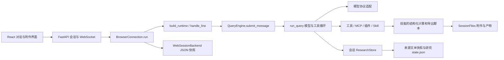
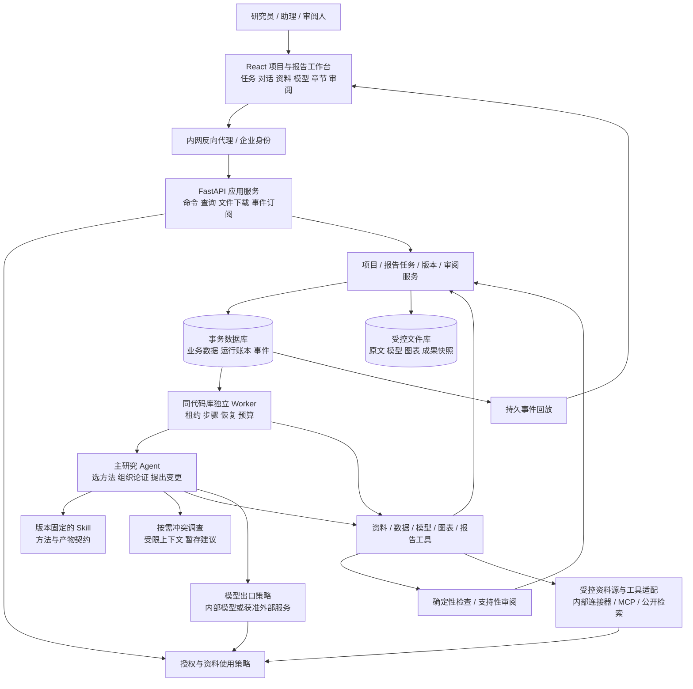
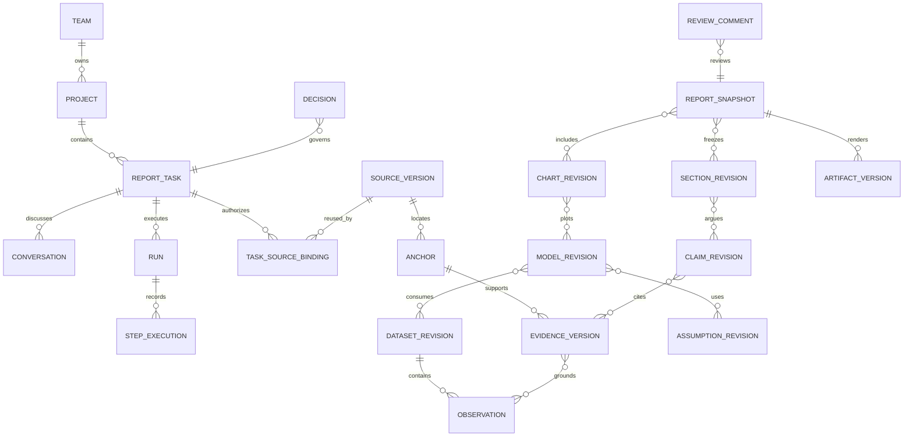
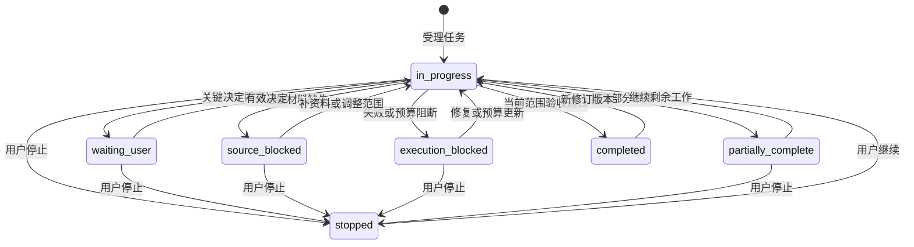
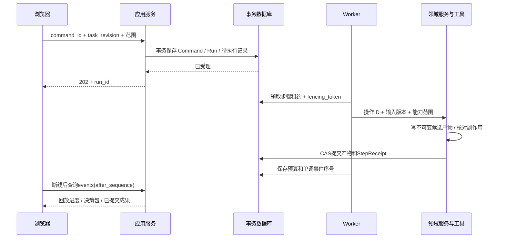
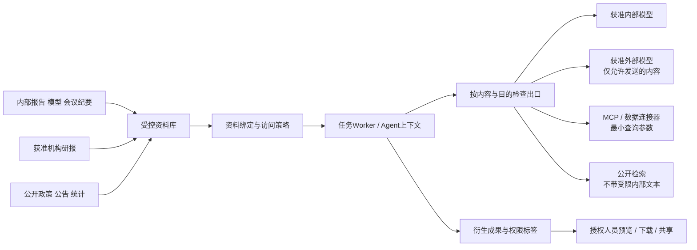

# 公司内部研报生产工作台：架构调整方案

设计日期：2026-10-08（Asia/Shanghai）。状态：供后续开发评审；本次仅新增此设计文档，未实施业务重构。

本稿保留仓库已有 `docs/research-workbench-architecture.md` 的可用设计内容，逐项对照当前代码核查，并补全接口、执行可靠性、安全、技术选型、迁移和验收。已有草稿不作为实现证据；实现依据见第 4 节和第 15 节。

## 1. 主要判断与推荐方案

**推荐在现有研究运行时上，渐进建设“以报告任务为中心的模块化单体”：一个主研究 Agent 负责研究组织和语义工作，持久业务工作流负责执行与交付，确定性服务负责数据、模型、版本和权限；保留按需、受限的冲突调查能力。** 不按四个生产阶段划分四个常驻 Agent，不先引入微服务、通用多 Agent 平台、LangGraph 或向量数据库。

最重要的调整不是增加技能数量，而是把长期研究成果从聊天和单次生成中分离出来：

1. **报告任务独立于对话。** 项目组织长期研究；报告任务定义本次交付；对话提供指令、解释和审阅入口；运行实例承担一次可恢复执行。同一任务可以跨多次运行、多天和多段对话推进。
2. **建立统一的成果和依赖模型。** 原文位置、数据观测、假设、模型输入输出、图表、章节及结论都具有稳定身份和不可变版本。Word、Excel、图表和对话摘要由同一份成果版本生成。
3. **先解决旧 Excel 模型的安全维护。** 当前导出的是新结果工作簿，并非读取、保护、局部修改和重算旧模型。首版只承诺通过兼容性验收的模型类别；复杂模型提供变更建议包和人工重算回传路径。
4. **把可靠执行从 WebSocket 中移出。** 先落库受理，再后台执行；断线只影响订阅。恢复基于步骤收据和副作用核对，不靠重放聊天。事务、幂等、租约和版本冲突控制先于并发扩容。
5. **公司使用首先需要身份和数据边界。** 首版建议内网单机部署：反向代理与企业身份、现有 FastAPI/React、同一代码库的独立 worker、SQLite 本地盘和受控文件库。用户数量与容量是假设，需压测；无需立即全面云化。
6. **核验分三层。** 程序检查口径、公式和关联；模型检查原文支持性、解释和反证；研究员决定关键口径、核心假设与观点。引用 ID 有效、脚本运行成功、调查 Agent 同意，都不等于研究结论成立。

首版优先实现财报点评、行业点评、单篇机构研报深度研读和基础多机构对标。公司/行业深度、方法沉淀和持续更新沿相同业务对象扩展，避免重新做一套系统。

## 2. 分析基线、证据与验证边界

### 2.1 本次分析对应的代码

- 仓库：`/home/jason/pythonproject/OpenHarness`；分支：`main`。
- HEAD：`c857680f2e782ecb1f2b19a98bef15d172148ac9`。
- 已核查的源代码、测试、前端、安装脚本、CI、依赖及贡献约定共 341 个文件的内容清单 SHA-256：`a1a8afdb46cfbd8f6e23e47950679687c450897e62018858dbb3dd367402f76e`。该清单用于核对本次未改业务文件，不表示逐行审阅了全部文件。
- **分析对象为上述提交之上的当前工作区，包括已有未提交和未跟踪文件，不是干净 HEAD。** `research/conflicts.py`、`web/citations.py`、`evaluation/`、技能独立脚本等已存在于工作区但尚未跟踪；旧 `utils/research_workflows/` 和四个技能的 `scripts/run.py` 已在工作区删除。文中的“已实现”指当前文件内容，不表示已随发布版本交付。
- 查找了仓库（含隐藏目录）及 `/`、`/home`、`/home/jason`、`/home/jason/pythonproject` 的适用 `AGENTS.md`，未发现该文件；读取了 `CONTRIBUTING.md`。
- 适用约定包括共享研究运行时、保护会话隔离和现有数据、研究身份格式兼容、真实模型评估单列、插件保留技能/工具/MCP/通用 hooks。本文不恢复已退休的终端编码、消息平台或通用 Agent 编排。新增持久业务工作流服务于用户本次明确提出的跨天报告生产需求；后续实施需同步更新相应贡献约定。
- 除本设计文档，本次不修改业务代码、测试、配置或现有文档，不提交/撤销已有工作区变更。

以下代码路径均相对于仓库根目录。引用采用“文件 + 类/函数”定位；后续实施前应重新确认工作区变更是否已合并。

### 2.2 实际执行的验证

先检查了所选测试及其 fixtures、子进程脚本：使用本地 PDF/JSON、临时目录、计算/导出和内存 Web 测试客户端；没有调用真实模型、真实 MCP 或外部数据源的测试路径。关闭了 pytest 第三方自动插件加载。

```bash
PYTEST_DISABLE_PLUGIN_AUTOLOAD=1 .venv/bin/python -m pytest \
  -p pytest_asyncio.plugin -q \
  tests/test_research/test_store.py \
  tests/test_research/test_conflicts.py \
  tests/test_research/test_skill_workflows.py \
  tests/test_web/test_citations.py
```

本次重新运行结果：**90 passed in 7.61s**。这验证了所覆盖的研究存储、冲突记录、固定输入计算/导出和引用投影，不验证模型能否从真实复杂材料正确取数、形成高质量论证或维护企业 Excel。未运行全量测试、浏览器 E2E、真实模型评估、外部检索/MCP、Docker、安装发布或企业模板兼容性验证。

技术约束另查阅了 openpyxl、SQLite、LibreOffice 官方文档，仅访问公开技术页面，未上传仓库或内部材料。选型依据见第 12 节。

## 3. 产品需求基线

### 3.1 用户与责任

| 角色 | 工作台职责与权限 | 最终责任 |
|---|---|---|
| 研究员/任务负责人 | 定选题、范围、研究问题；确认关键口径、假设和核心观点；编辑与交付初稿 | 研究判断与是否进入后续正式流程 |
| 研究助理 | 收集资料、整理数据、维护已授权模型输入和图表、准备分析；提交修改建议 | 资料准确登记和可复核的基础工作；默认不能替负责人确认重大预测变更 |
| 团队负责人/审阅人 | 按授权访问项目，检查论证/模型/报告，提出定位到版本的意见 | 初稿质量审阅；首版不隐含正式审批权限 |
| 平台管理员/资料管理员 | 管理身份接入、数据源、模型服务、插件和授权规则 | 平台运行和授权配置；管理角色不自动具有全部研究内容读取权 |

生产链：信息收集 → 数据整理 → 分析建模 → 撰写初稿。阶段是业务责任与产物约束，不是固定串行按钮或 Agent 拓扑。允许只做查证、整理一张表、更新实际值、研读一篇报告或修改一个章节；已有合格产物直接作为输入。

首版交付到**可审阅初稿**：可编辑 Word、适用时的 Excel 模型及图表、来源与假设说明、校验清单、待确认事项、变更摘要。模板可不要求某些文件，完成标准以任务约定为准。正式内部审批、合规审核和对外发布只预留独立接口与身份，不能由“初稿完成”自动触发。自动交易、个性化资产配置不在范围。

### 3.2 场景、输入输出与完成标准

| 场景 | 典型输入 | 交付物与必要完成条件 |
|---|---|---|
| 行业点评 | 政策/事件原文、旧政策或原状态、行业范围、截止时间、团队模板 | 新旧变化表、供需/竞争影响链、相关公司暴露与依据、关键图表、风险及正文；每条核心影响包含机制、时滞、成立条件与不确定性，不能只交新闻摘要 |
| 财报点评 | 新财报、历史同口径数据、旧 Excel、上一期报告、研究员原预测、可用授权数据 | 披露数据包、单季/累计桥接、业绩解释、实际值更新后的模型、预测变更建议、初稿；实际和预测分开，模型保护与重算有回执，关键假设未经确认不覆盖原预测 |
| 公司深度 | 公司对象、研究问题、初步假设、业务数据、模型与材料 | 围绕问题组织的章节、业务驱动预测/情景/适用估值、竞争优势与财务质量验证、反证和风险；模型关系与论证连贯，不以各技能输出齐全替代研究完成 |
| 行业深度 | 行业定义、产业链、地域/期间口径、统计与样本公司数据 | 市场空间、供需、周期和竞争分析，测算与比较模型、情景、行业图表；统计范围、覆盖缺口、重复计算控制明确，不能继承公司报告的必填公司字段 |
| 单篇深度研读 | 获准使用的完整研报及其图表 | 问题—观点—证据—方法—假设映射，公式与模型结构、成立条件/局限/待验证清单；解释关键推导，摘要只作为入口 |
| 多机构对标 | 指定研报样本、各篇日期和资料截止、指标范围，可选自身初稿 | 可比性矩阵、预测/假设/方法对比、共识与分歧、验证清单和自身初稿缺口；不把样本均值叫市场一致预期，不使用后来事实解释当时观点 |
| 方法学习迁移 | 参考研报、新对象、拟研究问题 | 可迁移方法说明、适用性检验、重新定义的指标/数据/参数、框架与模型草案；旧结论不继承；研究员确认后才进入团队模板/技能候选流程 |
| 继续与修订 | 原任务/成果版本、新资料、重点/假设变化或审阅意见 | 影响范围、局部修改包、新版本和差异、未解决事项；不重跑无关步骤，不覆盖人工修改，保留回退路径 |

共同完成门槛：约定交付物存在且可打开，必要章节/数据覆盖达标，关键数值同源一致，核心论断可回溯原文或明确标成推断/情景，模型保护检查通过，阻断性问题关闭，重要判断获得所需确认。**初稿允许明确标注非核心待确认项；影响核心判断的缺口只交付部分完成结果。** 用户把范围明确缩减为已完成的一阶段时，可在新 scope 版本下完成该阶段；不得悄悄缩范围。

### 3.3 暂定业务/容量假设

先沿用现有 A 股非金融公司数据能力作为财报点评适配范围；行业场景采用独立行业对象，不要求股票代码。金融企业、海外公司和多准则报表作为适配分支，不将现有 `Company` 校验当成永久产品限制。部署先假设一个公司、若干研究团队、约 5–20 位活跃用户、2–4 个并发研究运行，单任务数十份材料；这是设计起点而非已验证容量承诺。

## 4. 当前架构与业务差距

### 4.1 当前调用链



### 4.2 业务需求—现有实现—缺口—调整

“已有需改造”不表示功能失效，而是当前责任边界不足以满足新产品。

| 业务需求 | 当前实现及代码依据 | 判断与缺口 | 建议调整 |
|---|---|---|---|
| 多天、多人推进一份报告 | `web/app.py::Workspace/create_app`；`web/runtime.py::BrowserConnection.run`；`web/storage.py::WebSessionBackend`；前端 `useConversation.ts` | **已有需改造**：以会话为主体；无独立项目/报告聚合、人员归属和审阅模型；删除会话会删除其研究目录 | 新建项目/任务服务；对话关联任务；删除对话与归档成果解耦 |
| 长任务脱离浏览器 | `create_app.socket` 的 `finally` 调用 `connection.cancel()`；`BrowserConnection.run` 获取 `workspace.lock`；每会话只允许一个连接 | **已有需改造**：连接持有 asyncio task；同工作区生成全局串行；断线恢复历史不等于继续运行 | 持久 Run/Step、独立 worker、事件回放；资源租约替代全局锁 |
| Agent 执行与模型适配 | `engine/query_engine.py::QueryEngine`；`engine/query.py::run_query/_execute_tool_call_impl`；`api/client.py::SupportsStreamingMessages/AnthropicApiClient`；`api/openai_client.py::OpenAICompatibleClient`、`codex_client.py::CodexApiClient`、`copilot_client.py::CopilotClient` | **已实现，保留**：流式循环、工具执行、并行工具调用、错误/重试、上下文预算；没有报告阶段级完成契约与通用副作用账本 | 保留协议层，增加 TaskContext/CapabilityContext、操作收据与模型出口策略；并发工具须声明读写资源 |
| 上下文和成本 | `services/context_budget.py::RequestBudget/prepare_request`；`services/compact/`；`services/context_snapshots.py::save_context_snapshot`；`engine/cost_tracker.py::CostTracker` | **已有需改造**：预算估计、压缩前快照、usage；压缩可能调用模型；评测预算不等于生产任务总预算 | 任务累计预算覆盖主循环、压缩、调查、视觉、重试；恢复从业务对象组装上下文 |
| 工具、MCP、技能与插件 | `tools/__init__.py::create_research_tool_registry`；`tools/base.py::ToolRegistry`；`mcp/client.py::McpClientManager`；`tools/mcp_tool.py::McpToolAdapter`；`skills/loader.py::load_skill_registry`；`tools/skill_tool.py::SkillTool.execute`；`plugins/loader.py::load_plugin/_load_plugin_tools` | **已实现，需治理**：Skill 按需读取，不自动执行支持文件；有独立业务脚本；MCP 支持 stdio/HTTP；插件可加载 Python 工具、hooks、MCP；`commands/agents` 贡献已诊断忽略 | 保留扩展点；版本固定、工具命名冲突检查、管理员安装；Skill 权限声明转为可执行能力约束；禁止工具覆盖安全入口 |
| 研究事实与推导留痕 | `research/models.py::TaskContext/ResearchPlan/Evidence/ReasoningStep/Conclusion`；`research/store.py::capture/apply/_validate` | **已实现，保留后扩展**：来源内容哈希、不可变快照、revision、operation_id、文件锁、证据/推导关联和范围检查；主体仍是 session，假设是字符串列表 | 拆成任务级领域对象和仓储；保留旧 ID 映射；增加资料权利、结构化数据/假设/模型/章节 |
| 引用与更正传播 | `ResearchStore._invalidate/_ensure_scope/render_answer`；`web/citations.py::render_web_answer/project_answer_rows` | **已有需改造**：更正会沿证据/推导标记结论待复核，历史回答冻结；Web 投影只展示有效网站来源，file/MCP 引用不显示；未关联实际模型单元格/图表/章节 | 类型化依赖边与变更影响包；内部来源导航；历史冻结 + 当前过期标记分开；统一所有导出引用 |
| 事实冲突核查 | `research/conflicts.py::ConflictStoreMixin`；`tools/investigate_conflict_tool.py::InvestigateConflictTool/InvestigationClient` | **已有需改造**：当前确有受限调查子 Agent、暂存区、默认 12 次调用/180 秒、输入指纹和过期结果拒绝；由主 Agent 审查与 `resolve_conflict` 提交，不是研究员确认；调查仍有 bash/MCP 能力 | 保留按需调查，但缩窄能力；明确其只提供建议，重大口径/观点冲突必须形成持久研究员 Decision |
| 原文核验与准确性 | `ResearchStore._validate/verification_candidates`；`run_query` 的 conflict/citation/verification repairs | **已有需改造**：检查引用存在、来源类型、核验记录、输入关系；最终答复前有有限次修复；并未由程序证明原文蕴含结论；跨来源独立性主要是来源身份规则 | 分离提取核对、计算验证、语义支持、来源独立性和人工决定，取消一个 verified 标签涵盖所有保证的解释 |
| 附件与定位 | `utils/session_files.py::SessionFiles.upload/describe`；`utils/research_documents.py::parse_document/document_text`；`tools/file_read_tool.py::FileReadTool.execute` | **已有需改造**：PDF/TXT/MD，30 MB/1000 页等限制，PDF 页/文本行定位；扫描/加密文件报告缺口；无通用 Excel/Word 上传解析、结构化财务表定位/OCR | 新增资料版本、解析运行、页块/表格坐标；独立 Excel 通道；逐类扩展 DOCX/经批准 OCR；保留不猜数行为 |
| 财报点评 | bundled `financial-statement-analysis/.../scripts/models.py::FinancialPeriod` 与 `analyze_statements.py::calculate_financial` | **已有需改造**：Decimal、币种/合并母公司/重述、比率/勾稽/同期间同比/关键附注；脚本输入为模型整理的 JSON；没有完整单季桥接、环比、原预测偏差及旧模型更新 | 复用计算函数；补观察值维度、累计转单季、基准预测快照、业绩驱动桥及受控 Excel patch |
| 行业点评 | bundled `company-event-monitor/.../scripts/normalize_events.py::normalize_monitor`、`models.py::Event/MonitorResult` | **新增主业务结构**：现有是按次公司事件采集与双评分、去重、日期窗口/渠道状态；不是持续后台监控，也不是政策影响分析 | 新建 IndustryEventStudy：原状态、新变化、传导边、时间尺度、公司暴露和情景；复用搜索与事件规范化 |
| 公司/行业深度 | bundled `deep-investment-report/.../scripts/models.py::DeepResult`；`forecast.py::calculate_deep/project_year` | **已有需改造 + 新增行业流程**：固定公司章节、三情景/连续三年简化利润预测、单年敏感性；无完整预测三表/适用估值维护；强依赖公司对象 | 公司问题树、分部驱动模型与行业产业链/市场测算模型分别建契约；技能只提供方法，不机械拼接 |
| 单篇研读与机构对标 | bundled `research-report-digest/.../scripts/models.py::BrokerReport/Prediction`；`digest_reports.py::normalize_digest` | **已有需改造**：观点/论据/假设/预测/评级字段，按年份/指标/币种/basis 分组；尚无推导关系图、方法结构、历史可知信息限制和自身初稿对标 | 新增 ReportReading、ComparabilityGroup、Difference、MethodSpec；截止日期与假设关系显式化 |
| Excel、Word、图表一致 | `utils/research_exports.py::export_result/ReportContext`；各技能 `scripts/export_report.py`；`SessionFiles.register` | **已有需改造**：从同一结果 JSON 生成 MD/JSON/DOCX/XLSX；DOCX 为新文档，XLSX 为扁平结果新表；有引用身份检查，ID 可缺省；无团队模板保真、模型重算、正式图表实体及跨对话摘要一致性保证 | ReportSnapshot + 模板 renderer + ModelRevision + ChartRevision + ArtifactManifest；从事实引用绑定渲染 |
| 停止、打断和恢复 | `BrowserConnection.cancel/steer`；`ResearchStore.interrupt/require_replan/recover_pending_steers/stopped`；`QueryEngine._complete_interrupted_research_tools/continue_pending` | **已有需改造**：先保存 steering，再取消旧运行、要求重规划；补中断工具结果；停止的研究子任务写成 blocked；Web 没有独立 resume 命令接通完整耐久调度 | 持久业务状态与 Run 状态分离；保存/恢复/重跑三种操作；幂等扩展到产物和外部服务 |
| 权限、资料隔离和外发 | `permissions/checker.py::PermissionChecker.evaluate`；`web/app.py::guard`；`web/runtime.py::Redactor/StreamingRedactor`；`utils/network_guard.py::fetch_public_http_response` | **已有需改造**：本机 Host/Origin 保护、工具/路径审批、敏感路径、凭据脱敏和 Web 网络策略；无企业用户/RBAC/资料授权/模型外发政策；会话目录与证据 ID 隔离不等于任意文件/bash 的进程隔离 | 身份 + 资源 ACL + 用途/外发策略；所有入口统一检查；受控进程和网络出口；不得仅放开监听地址 |
| 并发执行隔离 | `sandbox/session.py::_active_session`；`tools/bash_tool.py::BashTool.execute`；`services/context_snapshots.py` | **已有需改造**：沙箱是模块级单实例；bash 继承环境并可指定 cwd；大工具输出和上下文快照位于全局数据目录 | 运行资源显式传递、每 run 沙箱/工作目录、精简环境、共享缓存带权限；先解决这些再撤全局锁 |
| 测试、安装与发布 | `tests/test_research/`、`tests/test_web/`、`frontend/web/e2e/workspace.spec.ts`；`evaluation/runner.py::ExperimentRunner`、`scoring.py::score_case`；`pyproject.toml`、`cli.py::web_cmd`、`hatch_build.py::CustomBuildHook`、`.github/workflows/ci.yml`、`scripts/install.sh/install.ps1/install_dev.sh` | **已实现入口，验证有限**：Python 依赖与 Web extra、React/Vite、wheel 可打包构建后前端、CI 包含 pytest/构建/E2E/wheel smoke；真实模型和 Langfuse 为单独评测路径；不能据文件存在宣称已过全部验收 | 继续保留；新增迁移、worker、重算引擎、权限和业务质量测试；生产迁移/备份纳入发布流程 |

当前最值得保留的是研究证据机制、通用执行循环、模型协议适配和技能内确定性计算。最需要调整的是状态所有权、业务契约、企业权限和旧模型维护；不是替换底层模型 SDK。

## 5. 推荐架构与关键边界

### 5.1 逻辑与部署架构



图中是模块边界，不要求独立网络服务。首版 API 与 worker 可为两个受进程管理器托管的进程，使用同一 Python 包、同一数据库和文件卷；计算/解析/Excel 在隔离子进程运行。worker 数量先保守配置；使用受限资源池支持多个任务，不直接并行改同一模型。

### 5.2 责任先于 Agent 划分

| 责任 | 推荐承担者 | 原因与限制 |
|---|---|---|
| 判断用户只查证、做阶段任务还是完整报告；规划问题与证据需求 | 主研究 Agent + ScopeService | 需要理解上下文；Agent 提案，应用服务保存 scope 和验收契约；不能自行放宽权限或完成条件 |
| 各类研究方法、章节要求、分析检查清单 | 版本化 Skill/业务 recipe | 方法可维护、可审阅；Skill 不拥有业务状态、不发放权限、不自动成为团队标准 |
| 调度、等待确认、取消、恢复、产物提交、版本冲突 | 确定性 TaskRunner/工作流服务 | 必须可重复、可观测；LLM 不能决定一次副作用是否发生 |
| 来源采集、原文定位、结构化抽取候选 | 工具/连接器 + 按需模型 | 获取和解析为确定性；语义抽取可用模型，候选先验证再进入认可数据集 |
| 口径对齐、公式计算、Excel patch、图表渲染、导出 | 确定性领域服务 | 程序执行、记录输入版本和输出哈希；方法/口径选择不隐含在代码里 |
| 论证、条件、反证和章节写作 | 主研究 Agent，可调用独立审阅步骤 | 需要完整问题上下文；结构化审阅结果，不自动覆盖人工判断 |
| 复杂证据冲突调查 | 现有受限调查 Agent，经改造后按需调用 | 有独立核查上下文与有限并行价值；不能视为独立事实认证机构，也不能直接提交正式判断 |
| 核心观点、重要预测/估值/评级判断 | 研究员 | 系统建议并展示影响；负责人确认以对象版本/输入指纹为范围 |

首版不新增四阶段 Agent。原文提取可以按文档并行工具化；主论证保持一个负责人，避免每个 Agent 各自掌握一份数字。后续只有在独立章节/数据源工作可显著并行、上下文可隔离且回归质量/成本优于单主 Agent 时，才引入专用子任务执行者；其返回版本化候选产物，仍由同一提交服务合入。

### 5.3 关键接口边界与所有权

| 边界 | 输入 → 输出 | 状态所有权与完成条件 | 失败处理 |
|---|---|---|---|
| TaskService | 用户目标、已有产物、截止和范围 → TaskRevision/计划 | 独占任务 scope/状态；所需输入或缺口明确，验收项可检查 | 只询问影响对象/交付的歧义；其余用显式假设推进 |
| SourceService | 授权 URI/文件/连接器结果 → SourceVersion + Anchor + ParseRun | 原文不可变；作者/机构/日期/期间及权利已登记，未知明确 | 解析缺页、超时、授权不足分别记 Gap；不写“无此事实” |
| DataService | Anchor + 提取候选 → DatasetRevision + ValidationResult | 拥有标准化观测与转换；强制指标/期间/单位/范围及来源 | 冲突保留候选，不覆盖；不确定字段送集中确认或留空 |
| ModelService | ModelRevision + 数据/假设 + PatchPlan → 候选 ModelRevision | 唯一模型写入口；白名单、旧值、公式结构差异、重算/校验通过才提交 | 隔离文件保留；失败不改基线；不支持模型交付补丁建议 |
| AnalysisService | 研究问题、证据/数据/模型 → ClaimRevision/MethodSpec | 主张分事实、推断、情景、团队判断；依赖完整且条件可解释 | 无支持则降为假设或移除，保留反证；模型失败可继续独立部分 |
| ReportService | 冻结依赖 manifest + 模板 → 章节、图表、交付包 | 拥有章节版本与成果快照；核心数字、引用、模板和缺口检查通过 | 不发布半套新旧混合文件；整体包 pending 或失败，旧包仍可用 |
| DecisionService | Proposal + 输入指纹 → 负责人决定 | 只有授权人员可作决定；记录理由、范围、有效版本 | 并发/过期决定拒绝并展示新差异；不因时间流逝自动同意 |
| TaskRunner | 已受理命令、步骤图、预算 → StepReceipt/Run 结果 | 拥有执行状态/租约，不拥有研究判断；每步提交或明确未提交 | 按幂等类别重试；结果不明先核对，不能盲重放 |
| PolicyService | 人员、资源、用途、目标服务 → allow/deny + policy_version | 应用/worker/下载/模型出口统一调用；工具没有自授予能力 | 拒绝为结构化可解释错误；外发不允许时改用获准内部模型 |

### 5.4 少量方案比较

| 决策 | 可行方案 | 推荐与引入时机 |
|---|---|---|
| 研究执行 | 继续全部藏在聊天循环；业务状态机包裹原循环；替换成通用图框架 | **业务状态机包裹原循环**。聊天循环保留灵活性；领域服务保证数据和交付。不以框架 checkpoint 代替业务事务；复杂条件图难维护且原型证明收益后再评估框架 |
| Agent 拓扑 | 单主 Agent + 受限调查；四阶段固定交接；动态多 Agent | **第一种**。多数阶段强共享上下文，交接易造成口径漂移；调查已有隔离价值。独立材料并行优先用工具/作业 |
| 部署 | 每人本地；内网单机共享；微服务集群 | **内网单机共享**为团队首版；严格离线小试点可每人本地，但没有自动共享；容量/高可用要求明确时再拆数据库与存储 |
| 数据库 | 继续各会话 JSON；SQLite；PostgreSQL | **新增业务表用 SQLite，旧格式走兼容层**。需要多机 worker、高写并发或已有统一数据库运维时直接 PostgreSQL，领域契约不变 |
| 检索 | 文件遍历；元数据 + 全文；全文 + 向量 | **元数据过滤 + 全文优先**；精确数字走结构化查询。跨大语料的方法/主题语义召回需要评测后加向量索引 |

## 6. 核心业务模型、版本和状态

### 6.1 实体关系



上图省略通用 `DependencyEdge`：任意被允许的版本实体之间可建立有类型依赖（取数、计算、引用、反驳、图表输入、模型输出、段落结论），不依赖数据库图扩展。表中多对多关系以显式关联表存储，保证外键和权限检查。

| 对象 | 核心字段/约束 |
|---|---|
| Team / Principal / Membership | 企业 subject_id、团队角色、有效期；服务账号独立标记；人员身份从服务端认证取得 |
| ResearchProject | owner/team、主题/对象集合、共享策略、默认资料使用/模型策略；长期容器，不等同操作系统 cwd |
| ReportTask + TaskRevision | type、subjects、research_questions、scope、requested_stages、as_of、known_by_cutoff、deliverables、acceptance_profile、负责人、基础成果；type 支持阶段查证/整理，不强制输出完整报告 |
| Conversation / Message | 一段对话固定归属一个 task；多对话可讨论同一任务；跨任务引用走 ReuseBinding，不能切换 ID 偷带历史。消息可锚定某个 task_revision/section_version |
| Source / SourceVersion / Anchor | Source 为资料身份；版本带原始文件哈希、发行机构/作者/出版日/资料期/获取时点、修订关系、原文 URL/内部 ID、授权；Anchor 用页+块/表+行列/文本行/Excel sheet-cell 定位，并保留原文片段哈希 |
| TaskSourceBinding / ReuseBinding | task/source_version、使用目的、授权有效范围、批准主体、复用自哪个任务/成果、时效与口径复核结果。正文引用导出不绕过原授权 |
| DatasetRevision / Observation | 数据集语义与 schema；每条观测包括对象、指标 ID、期间、期间类型、合并范围、分部、币种/单位/倍率、actual/机构预测/团队预测、披露版本、值/缺失原因、原值和原文锚点 |
| EvidenceVersion | statement、anchor、证据类别、引用用途、支持/反驳目标、各维校验状态、supersedes；机构观点不升级为原始事实 |
| ResearchQuestion / ClaimRevision | 问题、主张类别、证据和模型输出引用、方法、假设、结论成立条件、反证、置信/局限、人工确认；记录可审计论证摘要，不保存模型隐藏思维过程 |
| AssumptionRevision | 定义、指标/参数、值/单位/期间/场景、历史/外部/研究员来源、理由、负责人、重要性、确认状态与适用模型；与原文中的机构假设分开 |
| Model / ModelRevision / ModelBinding | 模型种类、基础文件、引擎、输入/公式/输出区域、模型语义映射、依赖版本、公式/假设变化、重算回执；可含业务驱动、市场空间、公司比较或估值模型 |
| ChartRevision | chart_spec、输入系列/模型输出版本、单位/时间范围、脚注和来源、主题、渲染器版本及文件哈希；图上数字不能由 LLM 绘制 |
| SectionRevision / Paragraph | 稳定 section_id/paragraph_id、outline、文本块、claim_refs、value_refs、chart_refs、待确认标记、编辑者与人工锁；标题只是显示字段 |
| ReportSnapshot / ArtifactVersion | 冻结 task/template/data/model/section/chart/decision 版本 manifest；每个文件带 hash、renderer_version、生成状态和 schema_version；“最新”只是指针 |
| ReviewComment / ChangeProposal / Decision | 评论锚定具体版本和对象/文本范围；建议包括差异/受影响范围；决定包括决定人、理由、允许范围、输入指纹、失效条件；审阅意见不会自动改正文 |
| Gap / ValidationResult | 资料缺失、授权、口径冲突、低可信提取等分类；严重性、影响对象、校验层、建议行动；不可用不等于数值为零 |
| Run / StepExecution / ToolOperation / Event | 执行计划版本、输入版本、能力/预算快照、attempt、租约、幂等键、输出收据、事件序号和错误；属于持久运行记录 |

财务期必须区分流量期间 `[start,end]` 与资产负债表时点 `instant`；`period_kind` 明确 FY/YTD/quarter/instant，财年起点可配置。原披露和重述保存为不同 observation 版本；同一个期末日不意味着同一指标口径。指标定义包含 numerator/denominator、含税/不含税、销量/出货量、行业统计地域/样本覆盖等，防止只靠 `basis` 自由文本对齐。

### 6.2 版本与修订规则

- 业务 ID 长期稳定，版本 ID 不可变；新版本记录 `parent_revision`、作者/服务、原因、时间和输入指纹。禁止就地改历史证据、模型文件和已交付 Word。
- 每个聚合有 `revision`；写操作带 `expected_revision` 和 `operation_id`。同 key 同请求返回原收据，同 key 不同请求拒绝；版本不匹配返回 409 和当前差异。模型写还需工作簿资源租约，不能只依赖页面单人编辑。
- 依赖边指向**版本**。源更正后，传递标记受影响的候选/当前成果 `stale` 或 `needs_review`，历史交付快照不改写。展示“历史交付当时内容”和“当前已知修订提醒”两个维度。
- 局部更新用 ChangeSet：新增数据版本 → 重算受影响模型区域/必要整本 → 图表与相关章节候选 → 一致性检查 → 原子更新当前 ReportSnapshot。摘要最后生成。
- 依赖图不完备时不能声称精确局部更新：至少把相关章节/模型乃至整份报告标为需复核，解释扩大范围原因。未知 Excel 间接引用按保守范围处理。
- 人工编辑默认保留。自动修订以基础版本、人工版本、建议版本做三方比较；冲突定位到段落/单元格，由编辑者决定。首版不要求实时协同编辑或 CRDT。
- 回退是创建一个引用旧内容的新成果版本，记录 rollback_of 与恢复理由；旧权限、授权期限、失效判断不随内容回退而重新生效。

### 6.3 状态机：业务状态不等于执行状态

报告任务的持久 `status`：

| 状态 | 进入条件 | 离开条件 |
|---|---|---|
| `in_progress` 进行中 | 已受理 scope，仍有可执行工作；即使当前 Run 排队也可处于此态 | 发生下列等待/阻碍/交付/停止事件 |
| `waiting_user` 等待用户 | 下一关键步骤依赖研究员决定、参数或范围选择，且当前无可推进的独立步骤 | Decision/输入到达并仍有效后恢复；若可先做其他步骤，仅记录 pending decision，不将整个任务置等待 |
| `source_blocked` 资料受阻 | 必要原文/授权/数据渠道缺失，所有必要剩余路径受阻 | 原材料/授权补齐或 scope 显式调整 |
| `partially_complete` 部分完成 | 已交付可用子产物，但原 scope 未全完成；缺口和下一步明确 | 补齐后产生新 Run，回到进行中；不是失败的美化标记 |
| `completed` 完成 | 当前 scope 的交付门槛通过且快照提交成功 | 新资料/修订请求创建新 TaskRevision 后回到进行中；保留历史完成时间与成果 |
| `stopped` 已停止 | 用户明确停止任务或撤回执行；保留产物 | 用户继续时核验输入和权限，创建新 Run |
| `execution_blocked` 执行受阻 | 新增：模型/worker/重算配置失败或预算耗尽且有限重试结束，不能归咎资料 | 配置修复/预算获准后恢复；用户无需为普通重试逐次确认 |

多个阻碍保存在 `blockers[]`，主状态由服务计算；有可用部分交付则主状态为 partially_complete 并附阻碍，有可运行独立步骤则 in_progress；否则优先用户决定、资料阻断、执行阻断。停止和完成必须由显式条件触发，不能用“模型不再调用工具”推导。



Run 状态另设 `queued/running/waiting/recovering/succeeded/failed/cancel_requested/cancelled`；Step 状态为 `pending/running/committed/skipped/blocked/failed/uncertain`。等待人工时保存 checkpoint 后释放 worker，不占住协程数天。取消单次 Run 可留下进行中但无活动执行的任务；“停止研究”才把业务任务置 stopped，界面必须清楚区分。Run 成功可以仅产出部分结果，不自动让 Task completed。

持久业务数据包括资料、数据、判断、确认、成果、审阅、权限和 Task 状态。持久执行数据包括受理命令、Run/Step/工具收据、预算、事件和恢复指针。WebSocket、asyncio Task/Future、模型/MCP client、tokenizer cache、流式 token 缓冲为临时上下文；可以重建，不能作为已完成/已确认的唯一证据。

## 7. 资料、数据、模型与报告生产设计

### 7.1 资料与检索

原始资料以不可变文件保存，解析文本和结构化抽取均为衍生版本。每份资料至少记录发行机构、作者、发布日期、材料覆盖期间、采集时间、修订关系、原文位置和使用权利；未知字段保留 unknown，不能用采集日代替出版日。授权包含可读人员/团队、允许任务用途、复用范围、是否允许外发到指定模型、是否允许导出或分享、有效期。会议纪要另记会议时间、整理人及其是否经确认。

证据类别采用 `disclosed_fact/institution_processed_data/institution_forecast/institution_view/team_judgment`，计算结果另记输入类别和方法。对机构加工数据，保存机构方法和原始依据的可得程度；不得因其数值格式像财报就视为公司披露。

检索按用途分层：

- 结构化查询：公司、指标、期间、单位、资料版本、模型结果、权限与任务绑定。用于取数、比较与依赖追踪。
- 全文检索：政策条款、财报附注、术语、表标题和定位；首版 SQLite FTS 可配中文分词/字符检索方案，用真实中文样本评测，不假设默认 tokenizer 已满足中文召回。
- 向量检索：后续用于研究主题、相似方法、历史论证发现。只索引获准材料，记录 embedding 模型及版本；外部 embedding 同样受外发约束。召回候选必须再读原文，不能用相似度确认事实。

访问过滤在查询前执行，返回原文、索引摘要和缓存时再次检查；不能先把无权片段交给 LLM 再过滤。任务只能检索已绑定资料或有权限的发现目录；发现后显式建立绑定，记录用途。复用历史成果必须重新检查截止日期、统计口径、原文版本和当前权限。材料版权或机构授权的具体条款由资料管理员配置，本设计不推定采购即允许全公司共享或发给外部模型。

### 7.2 数据处理与两类核验

处理流水线：解析 → 提取候选 → 原文定位核对 → 指标标准化 → 口径对齐 → 形成版本化数据集 → 计算 → 校验。每步保留输入、方法/代码版本、输出和缺口。不能把模型输出 JSON 通过 schema 校验等同于正确取数。

| 核验层 | 检查内容 | 责任与结果 |
|---|---|---|
| 提取准确性 | 原文行列、期间、正负号、小数点、币种、倍率、合并/母公司，表格跨页错位 | 确定性格式检查 + 原表对照；模型提供候选与核对记录；核心或低可信数字交人工。勾稽通过仍可能存在成组错取 |
| 口径一致性 | 累计/单季、流量/时点、实际/预测、原披露/重述、分部/地域和指标定义 | 程序阻止不可比运算；无法机械判定的定义差异生成冲突，研究员决定采用哪种口径 |
| 计算正确性 | 公式、精度、输入版本、分母为零/负值、重算、财务勾稽 | 确定性服务；Decimal 为数据账本精确值，Excel 数值按明示容差比较 |
| 引用有效性 | 引用 ID、版本和锚点存在；当前可访问；文件哈希一致 | 确定性服务，失效则禁止作为有效引用提交 |
| 引用支持性 | 原文是否支持该句，是否漏掉条件/否定、因果夸大、机构观点冒充事实 | 模型逐主张审阅并给原文片段、支持/部分支持/不支持和理由；关键项人工抽检/确认，不用同一模型自信评分当通过条件 |
| 论证与业务质量 | 影响机制、反证、假设适用性、图表含义、是否遗漏重大因素 | 主研究 Agent 自检、可选独立模型审阅、研究员最终审阅；模型审阅只产出问题单 |

校验状态分维记录，例如 `extraction=checked, calculation=pass, support=partial, human=unreviewed`。不要求每个披露事实必须有第二独立来源才能使用；单一权威原文可以在核对后引用，来源独立性与原文支持性分别评价。现有 verified 作为 legacy 标签保留原含义，不自动转换成全维度通过。

累计转单季只有在同公司、财年、币种、合并范围和披露基础可比时执行：Q2=H1−Q1，Q3=9M−H1，Q4=FY−9M；保留两个输入版本与公式。资产负债表时点值不能做这种差分。重述只覆盖部分期间、合并范围变化或缺少基期时不猜补，输出不可比原因。同比、环比、原预测偏差分别建立 comparison baseline；旧预测是当时冻结版本，不能用本轮更新后的预测评价本轮“超预期”。有获准的一致预期数据源时才增加对应基准。

### 7.3 现有 Excel 模型维护

模型维护采用 `inspect → map → propose_patch → validate → apply_to_copy → recalculate → compare → commit`，禁止 Agent 通过自由 shell 覆写生产模型。

1. **接入与盘点。** 保存原文件及 hash；识别工作表/顺序/隐藏状态、命名区域、输入与公式单元格、输出、样式、图表、合并区域、保护、外部链接、宏、数据连接、迭代计算。规则和已有映射优先，模型只提出语义映射；颜色不是可靠输入识别规则。
2. **模型映射。** 记录指标与单元格/区域对应、实际值/预测假设/公式/输出角色、允许写入范围和预期旧值。首次映射或结构改变时由模型负责人确认一次；后续同模板同结构复用。
3. **分开实际值和预测。** 已核对披露实际值可按获准规则自动生成 patch；未来预测与重要假设仅提出候选。新增实际值通过既有公式机械传导到未来预测时，显示受影响预测差异；若超出事先认可的影响阈值，提交负责人确认后才作为团队预测基线。
4. **补丁计划。** 每项包含工作簿基线 hash、sheet/cell、旧值/旧公式、新值/新公式、数据/假设版本、理由、影响输出、许可范围。公式变化单列，不混进“数据刷新”；新增行列、工作表和外部连接默认不属于普通更新范围。
5. **副本写入。** 对基线创建候选副本，检查实际变动单元格集合等于许可集合；核对未授权公式、工作表结构、命名区域、样式及关键 OOXML 部件。禁止自动刷新未批准的外部链接或执行宏。不能证明保真的文件走不支持分支，不覆盖原文件。
6. **重算。** 通过 `RecalculationAdapter` 执行已认可引擎，记录版本、输入/输出 hash、是否完成计算、错误单元格和外部链接策略。读取缓存结果必须确认来自本次重算；只设置“下次打开时计算”不构成完成回执。
7. **校验与提交。** 查 `#REF!/#VALUE!/#DIV/0!` 等错误、原有公式保护、历史期间异常变化、勾稽、关键预测差异、图表取数范围。全部通过且必要决定有效后，CAS 提交 ModelRevision 和输出数据集；失败保留候选和诊断，原基线不变。

首版支持经过样本验收的普通 `.xlsx` 模型。带宏、复杂数组/动态公式、数据表、Power Query、外部插件、循环模型或复杂图形的文件先做兼容性分类；“保留宏文件”不代表能安全执行和重算宏。无法支持时交付可定位的变更建议表，由研究员在既有 Excel 环境应用和重算，回传文件后核对差异及输出再继续。该路径标为人工模型步骤，不能伪称自动更新完成。

对于能通过兼容性测试的模型，可采用 openpyxl 修改副本并用隔离 LibreOffice 重算；这是待模型样本验证的推荐分支，不是对任意 Excel 的兼容承诺。Excel 原生引擎需求明确后评估受控桌面辅助或企业认可服务，不默认新增无人值守 Office 服务。

### 7.4 报告、图表与修改传播

TemplateVersion 定义报告类型、必需/可选章节、术语表、单位/舍入规则、图表主题、标题层级、页眉页脚、引用格式和待确认样式。报告数据先形成结构化 document model，再渲染 Word；不依赖把任意 Markdown 逐行转为最终团队文档。

段落内关键数字采用 `value_ref + display_format`，图表系列使用相同 Dataset/ModelOutput 版本，Excel 使用同一快照中的模型版本。渲染服务控制单位换算、百分比/百分点和舍入；对话简报从已提交 ReportSnapshot 生成，包含版本标识。自由文本中的数字还需提取比对，未绑定数字标警告，关键数字未绑定则阻断交付。

图表用确定性渲染器，保存数据表、chart_spec、可编辑定义和导出图片。首版可交图片加配套数据/定义，不承诺所有 Word 图表都为 Office 原生可编辑图表；若团队强制要求原生对象，纳入模板适配验收。

新资料或假设变更触发反向依赖遍历，生成影响清单：数据 → 模型输入/输出 → 图表 → 段落 → 结论 → 摘要。重新生成只针对相关候选内容；人工锁定段落给出建议差异。产物包提交前统一冻结 manifest，避免 Word 新数字而 Excel 仍是旧模型。未确认内容显式标记为“待确认：原因/负责人/影响”，且在交付说明汇总。

## 8. 人机协作与端到端流程

### 8.1 集中确认点

| 确认点 | 触发条件 | 展示内容 | 决定范围与重新确认 |
|---|---|---|---|
| 研究范围/重大方向 | 对象歧义、截止不同、核心问题发生变化 | 当前与拟议范围、已有成果可复用部分、新增工作和成本 | 绑定 TaskRevision；同范围常规取数无需反复确认，实质改方向再确认 |
| 重要口径冲突 | 权威来源不一致、可比性转换影响核心数字/论断 | 两侧原文位置、口径维度、可选处理、受影响模型/章节 | 绑定冲突输入指纹；新增更正或口径改变后原决定失效 |
| 首次模型映射/结构和公式改变 | 新模型、映射不确定、公式/工作表结构变更 | 输入/公式/输出地图、变动范围、公式差异和结果预览 | 绑定模板/结构 hash 和允许区域；结构未变的普通实际值更新自动执行 |
| 重要假设/核心观点 | 新预测参数、重要阈值变更、评级/目标价/核心结论建议 | 原值/新值、依据与反证、场景、敏感性、对估值/段落的影响 | 绑定参数/观点版本及依赖指纹；输入变化影响判断时重新确认，无关排版不触发 |
| 使用范围或预算扩大 | 用户请求超出现有资料授权/任务预算 | 所需授权/预算、用途、替代路径 | 业务用户不能批准超出自身权利的资料使用；转管理员策略流程。预算决定仅扩大本任务额度 |
| 方法沉淀 | 研究员提出将候选方法用于团队复用 | 适用对象/禁用场景、公式、数据要求、验证样本、授权依赖 | 形成候选模板/Skill；负责人认可并经维护流程后版本发布，单篇研读不自动发布 |

同类待决项合并成一个决定包，展示其作用范围与独立可推进工作。允许“保持原假设”“采用建议”“调整值”“暂缓”，不把“已读”当作认可。决定由服务端身份签名留痕，Agent 无权代填。输入变化按依赖指纹判定失效，避免任何 revision 增加都让全部确认失效。

### 8.2 财报点评

正常流程：

1. 解析请求 scope，载入旧模型、上期报告、原预测版本与已获准历史资料；已有数据/模型无需重建。核对报告对象、报告期、截止和团队模板。
2. 从新财报提取实际观测及附注，核对原文位置；规范单位和期间，保留原披露与重述；只对可比流量做累计转单季。
3. 计算同比、环比及相对原预测偏差，分别拆解量/价/结构、毛利率、费用、非经常项目和现金流；信息不足时保留无法解释部分，不强行把全部残差归因。
4. 自动准备并校验“实际值更新”模型副本；预测建议独立生成。展示重要假设变化与输出敏感性，等待有效决定期间可先写事实章节。
5. 决定通过后提交假设和候选模型，重算与检查；由同版本输出生成图表和正文，明确实际/预测、研究员原预测及获准市场基准。
6. 运行跨产物数值/引用/模板检查，交付 Word、Excel、图表、变更表和待确认清单；状态按当前 scope 判定。

异常和修订路径：

- 缺旧模型：可完成数据整理与文字分析，模型维护标缺口；用户若只要这两阶段，则按明确 scope 完成。缺财报页、OCR 不可靠：仅保留候选，不把空白填零。
- 原文/旧模型数值冲突：先查是否重述、单位或范围差异；能够按既定规则解释则登记转换；实质冲突提交集中确认，原值不被静默覆盖。
- 不支持的 Excel：提供 patch 建议并等待人工重算回传；无可靠新结果时正文不引用旧缓存作为本轮预测。
- 中断：已提交数据和实际值模型版本保留；恢复只调度未提交步骤，核验候选文件 hash/操作收据；输入更新使旧 patch 失效则重新提案。
- 用户改变未来毛利率：新建 AssumptionRevision，重算相关输出、图表、预测段落和摘要；已核对原文和历史取数不重跑；人工修改冲突由三方比较处理。

### 8.3 行业点评

1. 固定事件/政策原文版本、发布与生效时间、行业/地域和资料截止；读取旧政策/历史状态，形成条款或事件变化表。
2. 建立 `ImpactPath`：新增变化 → 受影响主体/业务环节 → 成本、供给、需求或竞争机制 → 中间指标 → 公司业务暴露 → 影响时段。每条边记录依据、条件、方向和不确定性。
3. 将事实、推断和情景分开；程序计算受影响市场比例或敏感性，模型解释机制并查反面证据，不能以新闻数量/情绪评分替代影响判断。
4. 按模板写事件概述、变化、行业和公司影响、图表及风险；重要方向/口径争议集中确认，相关公司仅在有暴露依据时列入。

缺基准政策时明确“尚无法核定相对变化”，先交原文核对与分析框架；数据缺失时做区间/情景并注明假设，不提供无依据精确值。条款版本冲突保留两侧与生效范围，无法解决的核心影响使交付为部分完成。断线不停止后台工作；真正取消后保留已采集原文和路径。新解释文件到达只更新相关条款、传导边、公司映射与段落；不重搜无关背景。

### 8.4 公司深度与行业深度

两者共用任务、证据、模型和章节基础设施，使用不同研究 contract 与步骤 recipe：

| 维度 | CompanyDeepStudy | IndustryDeepStudy |
|---|---|---|
| 研究骨架 | 公司问题树、业务分部、优势可持续性、增长与财务质量 | 行业边界、产业链节点、地域/产品分层、供需与周期机制 |
| 数据核心 | 分部量价、客户/渠道、资本开支、营运资本、公司财务 | 产能/产量/需求/库存、渗透率/替代、价格、统计样本与覆盖 |
| 模型 | 分部驱动预测、利润/现金流关系、适用估值与情景 | 市场空间分层测算、供需平衡、周期情景、可比公司指标矩阵 |
| 防误用约束 | 不将简化利润模型称为完整三表；估值方法需适配业务 | 不把样本市场当整体、重复累加产业链收入或混用出货与终端需求 |

类型契约进一步落实为：`CompanyDeepStudy` 保存公司/分部结构、问题树、竞争优势待验证主张、业务驱动关系、财务质量检查与估值适用性；`IndustryDeepStudy` 保存行业定义版本、产业链节点/边、地域与产品边界、统计覆盖和供需/周期驱动。共同基础层不强制行业对象填写公司代码、股本或公司利润模型。

业务驱动模型显式记录销量×价格、产能×利用率、客户数×单客价值等适用关系及分部汇总规则；行业测算记录总体/样本、分母、渗透率、地域、价格和链条去重规则。研究员选择与业务相符的方法，确定性服务计算并保留公式。估值为可选 `ValuationSpec`，含方法、指标定义、比较样本/估值时点或现金流/折现输入、场景和局限；未具备必要输入时不输出精确估值。估值模型结果与正式目标价/评级分开，后者只能来自研究员有效决定。首版简化利润脚本继续保持原能力，不扩称完整预测模型。

端到端：先保存研究问题、初步假设、反证计划与提纲 → 盘点已有成果 → 按问题建立证据与模型 → 逐个问题验证/修正 → 分章节形成候选 → 检查章节间因果和数字一致 → 交付完整初稿。允许“先做市场空间章节”“只检查财务质量”等局部入口。

跨天推进以问题/章节 milestone 保存数据和论证，不以聊天摘要作为唯一记忆。缺关键资料时独立章节继续；关键假设未确认则预测章标待确认。支持性不足可修正初步观点，实质改变核心方向时展示旧观点、反证、新观点和影响，交负责人决定。停止/恢复使用统一 Run 账本；新数据只更新依赖子图。总稿检查重点是章节共同回答研究问题、主张之间无矛盾、风险与结论条件一致，而非各技能输出数量。

### 8.5 单篇研读、多机构对标与方法迁移

单篇先建 `ReportReading`：报告身份与资料截止 → 问题/核心观点 → 支撑证据与关键图表 → 所用公式/模型 → 假设与成立条件 → 局限/待验证问题。每个观点链接其推导节点，原文未披露公式或参数则标“无法从原文重建”，不补造。缺页或仅有摘要时交付部分研读。

多机构正常流程：

1. 固定样本清单、报告日期、资料截止、授权和比较问题；读取每篇研读结构，不能把不同日期的报告当同一时点预测。
2. 建立可比组：对象、预测年份、指标定义、单位/币种、合并范围、实际/预测属性、预测场景、模型版本。不能对齐的记录单列；币种转换只有获准汇率与日期规则齐全时执行。
3. 对每项分歧分解为信息差（当时可知资料）、假设差（量价/利润率等）和方法差（预测结构/估值口径）；不做伪精确因果归因，无法分解时列待核实。
4. 输出样本内共识/分歧、预测表、关键假设矩阵、方法差异、后续验证清单。对比自身初稿的问题树、论据和反证，形成具体章节修改建议。

历史阅读使用 `known_by_cutoff`：later facts 可另开“事后复盘”视图，不能混入当时证据集。报告未写资料截止时标未知，可根据可核实引用给有界判断，不能默认等于发布日期。抽样机构预测即使算了均值，也只能称“所选样本均值”。

缺失预测年份或关键口径时不强行比较，继续比较可用观点/方法；核心定义冲突提交研究员，保留分组依据。中断恢复复用已提交的逐篇研读版本；新增一篇只增量研读并重建相关比较组。研究员修改自身观点不会反向改写机构原报告。

方法迁移从研读结构产生 `MethodSpec` 候选，抽象问题组织、指标定义、公式关系、图表表达与适用边界；对新对象逐项检查数据可得性与因果机制，重新估计参数/假设并验证。产物是适配框架、模型草案和资料清单。只有负责人认可适用性且获得必要复用权利后，才进入团队模板或 Skill 版本管理；不能自动沿用原结论或把原文整篇包装成 Skill。

## 9. 关键接口和产物契约

以下为后续开发的接口草案与精简示例，**均为新增设计，未实现**。采用现有 Pydantic 契约风格，但不能直接把技能输入 JSON 当成业务数据库。示例 ID 和数据为虚构；省略时间、作者等公共审计字段。

### 9.1 通用命令、查询和候选提交

所有写命令具有 `command_id/operation_id`、`expected_revision`、`schema_version`；认证人员、团队和权限由服务端注入，不能相信请求或模型提供的 `approved_by`。执行计划固定 workflow/skill/template/tool 版本，但每次读取、外发和提交仍检查最新有效授权。

| 接口草案 | 目的、结果及约束 |
|---|---|
| `POST /api/projects/{id}/tasks` | 受理目标和已有成果，返回 task_id/task_revision；没有歧义的阶段任务直接受理 |
| `POST /api/tasks/{id}/commands` | start、continue、revise_scope、cancel_run、stop_task、rerun_step、rollback；事务保存命令和待运行记录后返回 202；不等待模型结束 |
| `GET /api/tasks/{id}` | 当前 scope、状态、milestone、阻碍、决策包、成果版本和预算；不依赖某个连接的内存状态 |
| `GET /api/tasks/{id}/events?after={sequence}` | 按单调序号回放事件；WebSocket 可作为同一事件流的实时传输，断线后补读 |
| `POST /api/tasks/{id}/source-bindings` | 显式加入资料或复用历史资料；授权、时效、口径检查通过后才成为任务可读资源 |
| `POST /api/tasks/{id}/proposals/{id}/decisions` | 研究员处理候选；匹配 proposal/input_fingerprint；过期返回 409；Agent 无此能力 |
| `POST /api/tasks/{id}/reviews` | 评论定位具体 section/claim/model/报告版本，可要求修订；不自动改正文 |
| `GET /api/artifacts/{id}/download` | 下载时重新授权；只通过 opaque ID 取受控文件，不把服务端任意路径暴露为下载接口 |

领域服务内部主要接口：`extract_candidates(binding, parse_version)`、`commit_dataset(candidate, validation, expected_revision)`、`propose_model_patch(model_revision, inputs)`、`apply_and_recalculate(patch, decision_refs)`、`analyze(question, evidence_refs, model_outputs)`、`propose_section(base_revision, blocks)`、`validate_snapshot(manifest)`、`commit_snapshot(manifest, validation)`。每个方法返回产物 ID、版本、输入指纹、缺口和操作收据，不返回一个难以追踪的长文本作为全部结果。

主 Agent 可读取获准输入、提出计划/数据/观点/章节候选、请求工具执行；认可数据集、生产模型、Decision 和完成状态只能通过各自服务提交。工具输入使用资源 ID，由服务解析获准内容；自由绝对路径只在兼容适配器与受限运行目录中使用。

### 9.2 任务输入

```json
{
  "schema_version": 2,
  "command_id": "cmd_earnings_01",
  "type": "earnings_commentary",
  "subjects": [{"kind": "company", "id": "company_demo"}],
  "research_questions": ["Q3利润变化来自哪些业务与费用因素？"],
  "as_of": "2026-10-08T18:00:00+08:00",
  "known_by_cutoff": "2026-10-08T18:00:00+08:00",
  "requested_stages": ["data_update", "model_update", "draft"],
  "source_version_ids": ["srcv_new_9m", "srcv_old_h1"],
  "base_model_revision": "modelv_12",
  "base_report_snapshot": "reportv_previous",
  "original_forecast_snapshot": "forecastv_before_announcement",
  "template_version": "earnings_teamA_v3",
  "deliverables": ["docx", "xlsx", "charts", "validation_manifest"],
  "acceptance_profile": "reviewable_earnings_v1",
  "budget": {"max_model_calls": 40, "max_tokens": 300000, "max_active_seconds": 1800}
}
```

预算数值只是示例，运营配置应按模型价格和试点评测决定。`as_of` 是本次研究截止；`known_by_cutoff` 是可用于历史论证的信息可得边界。报告上架/资料实际获得时间可晚于出版日，应保留二者，不能仅凭 publication date 判定历史可知。`requested_stages` 不要求四阶段全选。若请求“只核实收入”，交付契约可仅为一个带出处的回答，不产生 Word。

### 9.3 数据观测与派生数据表

```json
{
  "dataset_revision": "datasetv_actuals_04",
  "observation_id": "obs_revenue_q3",
  "subject_id": "company_demo",
  "metric_id": "revenue",
  "period": {"kind": "quarter", "start": "2026-07-01", "end": "2026-09-30"},
  "basis": {"scope": "consolidated", "standard": "CAS", "currency": "CNY"},
  "value_kind": "actual",
  "value": "360000000",
  "unit": "CNY",
  "original_values": [{"value": "9.6", "unit": "亿元"}, {"value": "6.0", "unit": "亿元"}],
  "derivation": {
    "formula_id": "quarter_from_ytd_v1",
    "expression": "revenue_9m - revenue_h1",
    "input_observation_versions": ["obsv_9m_r1", "obsv_h1_r2"]
  },
  "source_anchors": ["anchor_9m_p18_row2_col3", "anchor_h1_p24_row2_col3"],
  "checks": {"extraction": "checked", "comparability": "pass", "calculation": "pass"},
  "missing_reason": null
}
```

数据库按 observation 行存，不把所有历史压进单个 JSON。原披露值同样是独立 observation；本例派生值引用两份输入版本。表格契约还包括 metric_definition_version、disclosure_revision、segment/geography、rounding_unit、restatement_relation 和 availability_time；缺失值保存 null 与原因。单位转换、期间差分、同比/环比、偏差分解均产生 TransformationRecord。

### 9.4 假设建议与模型补丁

```json
{
  "proposal_id": "proposal_margin_01",
  "assumption_id": "assumption_2027_margin",
  "base_revision": "assumptionv_3",
  "parameter": "gross_margin",
  "period": "FY2027",
  "scenario": "base",
  "old_value": "0.32",
  "proposed_value": "0.30",
  "origin": "team_judgment",
  "rationale": "新增成本因素可能持续；尚需核实传导比例",
  "supporting_evidence_versions": ["evv_cost_2"],
  "counter_evidence_versions": ["evv_price_1"],
  "materiality": "high",
  "affected_outputs": ["model_output_2027_profit", "section_forecast", "chart_margin"],
  "status": "pending_decision",
  "input_fingerprint": "sha256:example-inputs"
}
```

```json
{
  "patch_id": "patch_actual_01",
  "base_model_revision": "modelv_12",
  "base_file_hash": "sha256:example-workbook",
  "mapping_version": "mappingv_2",
  "changes": [{
    "sheet": "实际数据", "cell": "H12", "role": "actual_input",
    "expected_old_value": null, "new_value": "360000000",
    "observation_version": "obsv_revenue_q3_1"
  }],
  "formula_changes": [],
  "allowed_region_id": "region_actuals_2026",
  "recalculation_policy": "approved_xlsx_engine_v1",
  "required_decisions": []
}
```

金额以 Decimal 字符串通过契约传输，写入 Excel 后根据模型单位映射为数值。`required_decisions=[]` 只适用于映射和自动实际值更新规则已经认可的范围。把本例改为预测假设或公式 patch 后，必须引用有效 Decision；不能靠 Agent 将 materiality 写成 low 绕过策略。最终 ModelRevision 保存补丁、公式差异、输入/假设/决定版本和重算收据。

### 9.5 分析结论与章节草稿

```json
{
  "claim_revision": "claimv_policy_2",
  "question_id": "question_supply",
  "kind": "inference",
  "statement": "新增限制可能在短期约束新增供给",
  "evidence_versions": ["evv_policy_clause_1"],
  "method_id": "method_capacity_constraint",
  "assumption_versions": ["assumptionv_enforcement_1"],
  "impact_path": ["新增许可限制", "新增产能投放放缓", "短期供给增速下降"],
  "time_horizon": "未来两个季度",
  "conditions": ["执行范围覆盖拟新增项目", "库存不能完全缓冲"],
  "counter_evidence_versions": ["evv_inventory_1"],
  "limitations": ["执行节奏尚不明确"],
  "support_review": "partial",
  "decision_status": "pending"
}
```

```json
{
  "section_id": "section_performance",
  "base_revision": "sectionv_6",
  "candidate_revision": "sectionv_7_candidate",
  "blocks": [{
    "paragraph_id": "para_revenue",
    "text_template": "第三季度收入为{{revenue_q3}}，变化主要来自……",
    "value_refs": [{"key": "revenue_q3", "observation_version": "obsv_revenue_q3_1", "format": "亿元:2"}],
    "claim_refs": ["claimv_revenue_driver_2"],
    "citation_refs": ["evv_revenue_1"],
    "chart_refs": ["chartv_revenue_2"],
    "pending_items": ["需研究员确认量价拆分假设"],
    "human_edit_policy": "preserve_manual_changes"
  }]
}
```

结构化 claim 保存研究方法、可见依据和条件；章节组织论证，不要求每句都是数字模板。重要数值绑定 `value_ref`，纯文学表述、过渡句可使用普通文本。引用和待确认项在 Word 正文及交付摘要均可见，不能只藏在 JSON 附件。评级/目标价字段缺省，若存在则必须引用研究员决定和适用模型版本。

### 9.6 校验结果、审阅意见和交付包

```json
{
  "validation_id": "validation_08",
  "target_manifest_hash": "sha256:example-manifest",
  "checks": [
    {"rule": "cross_artifact_numeric_consistency", "layer": "deterministic", "result": "pass"},
    {"rule": "protected_formula_unchanged", "layer": "deterministic", "result": "pass"},
    {"rule": "claim_source_support", "layer": "model_review", "result": "partial",
     "target": "claimv_policy_2", "anchor": "anchor_policy_p3", "reason": "原文未给出执行节奏"}
  ],
  "blocking_issues": [],
  "warnings": ["非核心情景参数待确认，已在正文标记"],
  "gate": "reviewable_partial_draft"
}
```

```json
{
  "review_id": "review_03",
  "report_snapshot": "reportv_5",
  "target": {"kind": "paragraph", "id": "para_revenue", "revision": "sectionv_7"},
  "comment": "补充产品结构变化证据，当前归因过强",
  "severity": "major",
  "requested_action": "revise_claim_and_paragraph",
  "status": "open"
}
```

ReviewComment 状态 `open/addressed/accepted/rejected/obsolete`；`addressed` 表示有修订回复，关闭意见按授权的审阅规则处理。原版本被替换时评论可以继续映射到相同 paragraph_id；无法可靠映射则显式 obsolete 待重新定位，不自动认为问题已解决。

ReportSnapshot manifest 固定 `task_revision/template_version/source_bindings/dataset_revisions/model_revisions/claim_revisions/section_revisions/chart_revisions/decision_refs/validation_refs`。ArtifactManifest 固定所有文件的版本、哈希、渲染状态、源 manifest 和待确认清单。文件全部生成并校验后，事务提交包的可见指针；失败候选不可作为最新包下载。跨数据库和文件系统的原子性通过“先写不可变文件，再事务登记引用”实现，未登记文件由保留期清理，不靠同时覆盖四个文件模拟事务。

## 10. 执行可靠性与恢复语义

### 10.1 从受理到提交



首版工作流是受版本管理的步骤图，不要求四阶段固定串行。每步声明 required_inputs、input_versions、outputs、resource_reads/writes、能力、完成条件、可重试错误和预算。Agent 可以提出新步骤或重新规划，但必须经 schema/权限/预算检查后创建新的 PlanRevision。执行服务调度确定的步骤；自然语言“完成了”不能替代 StepReceipt。

两类 checkpoint：业务 milestone 提交了可用数据/模型/章节；运行 checkpoint 记录未完成步骤、工具操作与候选位置。只有前者可以对用户称为阶段成果。流式回答可展示临时文本，并明确其尚未成为交付版本。

### 10.2 幂等和副作用分类

| 操作类别 | 收据与恢复策略 |
|---|---|
| 本地只读解析/标准化/计算 | 输入 hash + 代码版本生成确定性缓存键；校验缓存与权限后复用；无有效缓存可重算 |
| 外部只读检索/下载 | 已有完整结果快照直接复用；未得到结果可有限重试，但它是一次新的采集尝试，记录时间和成本；历史 as_of 不随重试漂移 |
| 数据库提交 | operation_id + 请求指纹唯一约束；版本 CAS；已提交返回原收据；不同 payload 使用同 key 拒绝 |
| 文件生成/模型副本写入 | 操作 ID 对应唯一候选目录和 manifest；检查候选 hash/收据；已登记不重复复制注册；不覆盖正式文件 |
| 外部可写操作 | 首版一般禁用；确有授权时要求服务端幂等键或可查询的 remote operation ID；超时无法判断是否发生则置 uncertain，人工或查询核对后才能再试 |
| 模型调用 | 可重试临时错误但不保证 provider 只计费一次；保存 request/result hash 和 usage。已完整保存结果时复用；结果未知记录可能成本，不声称调用恰好一次 |

`operation_id` 解决重复请求，`expected_revision` 解决同一对象并发变更，租约/fencing token 解决失效 worker 迟到提交，三者分别负责不同问题。步骤开始与提交之间不能保持长数据库事务或持有数据库写锁等待网络。外部调用始终处于事务外，提交时重新确认输入版本、有效授权和取消标志。

### 10.3 取消、断线、重启和重新执行

浏览器连接只持有事件订阅和短请求。关闭标签页、网络断开、浏览器刷新不取消 Run，也不删除未决 Decision。后台任务状态由服务端返回，前端本地 busy 仅用于交互，不能当作权威执行状态。

`cancel_run` 先落库 cancel_requested；停止调度新步骤，取消可取消的模型/网络调用和子进程，并核对在途副作用。已经提交的数据保留，未提交候选标取消；在取消之后提交的迟到结果必须被 fencing/CAS 阻止，或进入可检查的未提交暂存区。若操作恰在取消前提交，取消回执明确列出保留产物。不能声称取消会撤销已经发出的外部请求。

`stop_task` 是业务意图：同时取消活动 Run，并设置 stopped，后续不会自动调度。`continue_task` 由用户重新授权继续当前范围，检查有效权限、未决确认、输入版本和剩余预算，然后创建新 Run。`rerun_step` 则创建新 attempt，可更新工具/模型版本或输入；旧结果不被静默抹去。

Worker 启动后扫描过期租约，将 running 步骤置 recovering/uncertain；先查收据和候选，再决定调度。进程死于“文件生成之后、数据库提交之前”时可校验并登记既有文件；死于“数据库提交之后、事件发送之前”时从已提交记录补发事件。恢复不重放整段历史聊天，更不能重发全部工具调用。

有待决用户问题的步骤写入持久 DecisionRequest 后进入 waiting，释放 worker；有效回答通过命令重新入队。新数据或审阅意见到达时生成 ChangeSet，保留不受影响的步骤；旧输入的候选和决定按依赖指纹失效。既有聊天摘要作为上下文辅助，业务实体是恢复权威。

### 10.4 并发、失败、预算和运维

同一 task 默认一个写运行，允许只读检查或隔离候选作业并行；同一个工作簿/数据聚合/章节提交须按资源租约和版本 CAS 串行。不同任务可并行，但先消除 `sandbox/session.py` 的模块全局沙箱状态、继承环境、共享 cwd 与未授权缓存等问题，再撤销 `Workspace.lock`。首版不要求多人同时编辑同段文字；普通版本比较与冲突提示足够。

重试区分模型限流/网络超时、工具参数错、资料缺失、权限拒绝、重算不支持和质量失败。只有临时错误自动退避，次数和总时间有界；参数错可在同预算内修正一次或少量次数；授权拒绝、不可读原文和模型兼容失败不能通过反复调用解决。失败保留结构化错误、影响范围和可继续步骤，而不是统一写“模型配置错误”。

预算分任务累计和 Run 本次增量，记录主模型、调查、压缩、视觉、embedding、语义审阅和全部重试。调用前预留 token/成本预算，完成后按 usage 结算；缺 usage 的请求采用保守估计，标成本不确定。等待用户不消耗 active_seconds，但可以有单独 deadline；超预算保存部分成果并请求扩大预算或缩范围，不自行更换更贵模型。

监控以 task/run/step/operation ID 贯通：步骤耗时、重试、外部渠道状态、工具错误、预算、恢复、候选拒绝和研究员修改量。普通运维日志不记录全文或凭据。备份同时包括数据库快照、被引用原文件/成果和版本 manifest；定期演练恢复与授权一致性。达到生产所需的 RPO/RTO 前不承诺高可用。

## 11. 权限、安全与数据流

### 11.1 身份和共享边界

首版一个公司、多个团队，采用企业 SSO/OIDC 或公司已有认证代理；若尚无身份提供者，试点可用平台本地身份，但接口保留稳定 subject_id。浏览器直接提供的身份 Header 不可信，只接受隔离代理注入且应用端口不可绕过代理；会话、REST、WebSocket、下载和 worker 均执行同一权限规则。改为内网部署需配置可信 Host/Origin、TLS、会话安全和 CSRF 等请求边界，不能只放开当前 local_host 校验。

项目访问是角色与资源授权的交集。研究员是任务负责人；助理可管理基础材料和候选内容，默认不能批准重大预测；审阅人可读获准成果和提出意见；管理员可配系统但不自动读取所有项目。任务私有、项目共享、团队共享、公司共享是不同范围，默认项目内最小范围；共享须同时满足原始材料和衍生成果的权利约束。首次上传可以继承项目策略，但机构研报另受采购授权规则限制。

模型输出、图表和章节可能包含受限来源数据，其权限标记由输入派生，不能因变成摘要而自动降密。混合材料产物默认取更严格限制；确需扩大范围时需有经过授权的去敏/聚合规则和独立产物版本。显式复用保存来源任务、对象版本、理由、复核与授权，不复制旧聊天来隐式带入材料。

### 11.2 各出口允许什么数据



资料策略至少表达 read、task_use、team_reuse、export、external_model、embedding、log_trace 及期限。模型 profile 记录目标服务、部署位置、可接受数据级别、管理员认可状态及用途；供应商合同和数据留存边界需要公司确认，平台不推定有 API Key 就可发送内部资料。

如果全部来源只允许内部模型，则规划、抽取、压缩、视觉识别、调查和审阅均应选获准内部服务；无可用服务时保留输入并报告执行受阻，不能为了完成调用备用外部模型。外部网页查询只带公开对象、指标或关键词，不能把内部纪要的原句送入搜索。MCP 工具按服务和动作配置能力；远端 readOnly 等声明只是辅助，实际副作用与外发范围由平台管理员审核。

搜索/连接器/模型出口应用同一 capability context，包含 task_id、actor、资源绑定、允许动作、目标服务、预算、策略版本和失效条件。授权检查覆盖工具参数及出站 payload，允许的“读文件”不等于允许把内容发到任何模型。工作流服务重新检查候选的所有依赖，防止 revoked 来源通过缓存、旧快照或已生成文件继续泄露。历史记录保留审计存在，但无权用户不再得到原文或受限产物。

### 11.3 工具、插件、外部指令和日志

外部文档、MCP 返回和搜索摘要始终作为资料。使用固定系统任务和结构化引用，不把材料中的“忽略之前指令”“调用工具”“上传资料”转为命令。提示词约束用于减少诱导，实际权限依靠工具入口、资料 ID 解析、模型出口和运行隔离；不宣称提示词即可解决注入。

已安装的 Python 插件工具和 hooks 可以执行代码，应属于管理员维护的可信代码。保留现有贡献模式，但增加版本/来源/校验清单和命名空间；`ToolRegistry.register` 目前同名覆盖，后续默认拒绝冲突并保护 policy/decision/commit 等核心工具。Skill 元数据的 permissions/required_tools 用于生成能力申请和工具子集，不能授予新权利。团队方法候选通过独立维护流程后才发布，不让研读一篇外部文档直接变成可执行插件。

首版优先将财务脚本和导出包装为受类型约束的服务工具，减少普通研究员使用自由 bash。必须保留的脚本运行于每 Run 独立目录/进程或容器，只挂载已绑定资料和候选输出、使用精简环境、无凭据继承；公开网络由受控连接器代理。当前 Docker 后端默认无网络有保留价值，但整个项目可写挂载和全局 active session 仍需改造，不能把“有 Docker”当作任务隔离验收。

审计保存谁在什么任务读取/复用/外发/修改/确认了哪个版本、何种策略、操作结果和哈希，不必保存材料全文。凭据脱敏沿用现有机制，并扩展到研究对象保密字段、个人信息和错误响应；内容 trace 默认本地受控、按需启用、限定可读人和保留期。上下文快照、工具大输出、评测 workspace 和 Langfuse 外发都属于敏感数据出口，使用同一规则；不可把生产任务内容默认同步到观测平台。

## 12. 技术选型、复杂度和引入时机

以下技术事实查阅公开官方文档；其余推荐为结合当前实现和暂定规模的架构判断，尚未做容量或企业模板实验。

| 领域 | 首版推荐 | 可行替代与引入条件 | 复杂度与迁移成本 |
|---|---|---|---|
| 执行编排 | Python 业务状态机/步骤 recipe 包裹 `run_query`；持久 Run/Step/Decision | LangGraph 等图框架只在条件图、检查点维护成本实际过高且原型通过恢复/副作用测试后评估；它不代替 ACL、业务版本与收据 | 中等：新增调度/提交边界，保留循环与协议；避免一次性重写 |
| 结构化存储 | SQLite 本地盘，领域表/关联表 + 部分 JSON 扩展字段，显式 schema migrations | 已有公司 PostgreSQL 运维、多机 worker、明显并发写瓶颈或高可用要求时直接 PostgreSQL | 中等：当前 JSON 导入/映射是主要成本；仓储接口与领域契约保持独立 |
| 原文和产物 | 受控本地文件库，不可变内容与引用 manifest；数据库存元数据 | 多机共享和可靠对象存储运维成熟时 S3 兼容对象存储 | 低至中：沿用哈希快照、SessionFiles 路径安全；调整身份与访问范围 |
| 全文与语义检索 | 元数据 + FTS/中文分词适配；精确数据走 SQL | 大量跨项目资料方法发现需求和召回评测证明价值后，加独立可重建向量索引；已有搜索服务时可接其 ACL 能力 | 中：中文召回、锚点和权限比选库更关键；索引不作为权威存储 |
| Excel 修改 | 现有 openpyxl，用于已通过保真测试的 xlsx 副本和检查；独立重算适配器 | 兼容文件可试隔离 LibreOffice/UNO；复杂原生模型优先建议表 + 人工 Excel 重算回传；原生服务需企业认可后评估 | 高：模型映射、公式保护、缓存真实性和样本兼容性是首版最大专项 |
| Word 生成 | 保留 python-docx；增加结构化 document model 和版本化公司模板 renderer | 复杂占位符可评估模板库；要求高度保真、原生图表/公式时增加特定 Office 模板适配器 | 中至高：当前通用 Markdown 转文档保留为 legacy 简报导出，团队模板独立适配 |
| 图表 | 确定性图表服务，保存数据/规格，采用团队认可的绘图库，首版可用 Matplotlib | 已有前端图表体系可复用规格；Office 原生可编辑图表按实际模板要求另适配 | 中：新增依赖与字体部署；图上数字必须同源可检查 |
| 后台任务 | 同仓库独立 worker + 数据库队列表/租约；服务管理器启动、失败重启 | 单进程后台协程适合演示，持久账本仍必需；多机吞吐/独立调度需要时引入成熟队列，如公司已有任务平台 | 中：可靠性来自收据与恢复设计，消息队列本身不保证恰好一次 |
| 企业身份 | 已有 SSO/认证代理 + 应用 PolicyService | 无企业 IdP 的小试点本地身份；正式共享前确认迁移方式 | 中：所有 API/文件/事件/worker 入口都需改造，不能只加登录页 |
| 观测与评测 | 本地审计和现有 evaluation 结构，业务指标分层 | 经授权才向公司批准的观测平台发 trace；保留可选 Langfuse 适配 | 低至中：沿用 recording observer，控制内容留存与出口 |

SQLite WAL 适合同机应用与 worker，但仍需处理写锁竞争、短事务和 checkpoint；多进程数据库必须在同一主机，不能把 WAL 数据库放在网络文件系统。故本方案的 SQLite 分支明确是单机本地盘；多机分支改用服务型数据库。[SQLite 官方 WAL 文档](https://sqlite.org/wal.html)

openpyxl 可以读写公式，**不会计算公式**。`data_only=True` 读取的是上次计算保存的结果，不能作为本轮重算证据；`keep_vba` 是保留 VBA 元素，不代表可执行。其读写并不保留所有 Excel 对象，官方提示既有文件的 shapes 可能丢失，因此不能承诺任意模型结构保真。模型分类、原件保留和修改前后部件检查是选用它的前提。[公式说明](https://openpyxl.readthedocs.io/en/stable/simple_formulae.html)、[加载与保存限制](https://openpyxl.readthedocs.io/en/stable/tutorial.html)

LibreOffice 官方支持 headless 与外部 API 控制，也提供转换参数；这些说明其可作为隔离重算候选，**不证明其与公司 Excel 模型兼容**。后续需对实际工作簿验证公式、迭代计算、图表和保存结构；不以进程退出码或转换成功作为财务模型验收。[LibreOffice 启动参数](https://help.libreoffice.org/latest/en-US/text/shared/guide/start_parameters.html)

首版部署可用一台内网 Linux 主机：反向代理 + FastAPI/React + 同包 worker + 本地数据库/文件库；计算沙箱与可选重算进程单独受限运行。应用和 worker 同版本发布，但可独立重启。数据库与文件备份需要一致 manifest。安装包继续走现有 wheel/Web extra 与前端构建入口；企业服务配置、worker 和受控重算引擎作为附加部署配置，不把所有依赖塞进个人安装脚本。

任何升级路径均保留领域接口：SQLite → PostgreSQL、本地文件 → 对象存储、数据库队列 → 消息队列、FTS → 混合检索。先收集锁等待、积压、恢复耗时、授权过滤开销和成本数据，再决定拆服务；跨团队边界本身不要求微服务。

## 13. 渐进迁移计划

### 13.1 文件和模块处置

下表新增路径是建议布局，尚不存在的模块不要在实施时误当现有代码。包名可由开发团队统一，但责任边界和迁移顺序需保持。

| 当前文件/模块 | 处置 | 后续实施内容 |
|---|---|---|
| `api/client.py`、`openai_client.py`、`codex_client.py`、`copilot_client.py`、`api/usage.py` | 保留，局部修改 | 继续协议统一；包裹出口策略、预算、请求收据；订阅型服务是否适合公司内部数据另行确认 |
| `engine/query.py`、`query_engine.py`、`stream_events.py`、`services/context_budget.py`、`services/compact/` | 保留与修改 | Agent 返回候选产物；TaskContext 动态组装；校验修复有界；流式事件带 run/step；不让循环直接决定 Task 完成 |
| `runtime.py::build_runtime`、`RuntimeBundle` | 修改 | 增加可选 task/run/capability context、仓储和沙箱依赖注入；兼容已有 session_id 构建入口；不复制第二套运行时 |
| `web/app.py`、`runtime.py`、`storage.py`、`models.py` | 修改与逐步拆分 | REST 命令/查询、持久决策和事件订阅；BrowserConnection 收缩为连接适配器；保存旧会话投影接口 |
| `frontend/web/src/ChatPage.tsx`、`useConversation.ts`、`api.ts`、`ConversationTurn.tsx` | 修改 | 展示任务而非仅会话 busy；项目/任务导航、资料/模型/章节/审阅、决定包、局部差异、继续/停止/恢复；保留对话入口 |
| `research/models.py`、`store.py`、`prompt.py`、`conflicts.py` | 保留兼容层，逐步提取领域服务 | 旧 schema_v1 只做兼容读取/定向迁移；Evidence/Reasoning/Conclusion ID 映射；数据/模型/章节实体进入新版本契约 |
| `tools/research_memory_tool.py`、`investigate_conflict_tool.py` | 修改 | Task 范围授权；候选写入；冲突调查能力缩窄、输出版本化建议；研究员 Decision 从 Agent 仲裁分离 |
| `web/citations.py`、`utils/research_exports.py`、各技能 `scripts/export_report.py` | 修改/保留 legacy | 内部文件与 MCP 原文导航；稳定 evidence 绑定；历史冻结；新团队模板走 ReportService，旧四格式简报仍可打开 |
| `utils/research_documents.py`、`session_files.py`、`file_read_tool.py` | 修改 | SourceVersion/Anchor、独立解析作业；Excel/DOCX 通道；原解析缺口行为保留；产物登记变为幂等和版本化 |
| `financial-statement-analysis/.../scripts/analyze_statements.py` | 保留计算规则，新增适配器 | 类型化 observation 转旧输入；累计桥接/环比/原预测偏差置新增 DataService；不改现有函数含义造成旧结果漂移 |
| `company-event-monitor/.../scripts/normalize_events.py` | 保留 | 公司事件规范化继续；新 `industry-commentary` recipe/契约单独承担政策变化和影响链 |
| `research-report-digest/.../scripts/digest_reports.py` | 保留和扩展适配 | 旧预测分组可复用；ReportReading/方法图/历史信息边界/差异归因独立建对象，放宽必须公司对象的限制 |
| `deep-investment-report/.../scripts/forecast.py` | 保留为简化利润模型 | 明确适用范围；公司驱动模型和行业测算另建类型；逐步淘汰“缺齐几个技能才能做深度”的强制入口 |
| `tools/__init__.py`、`tools/base.py`、`mcp/client.py`、`plugins/loader.py`、`skills/loader.py`、`hooks/executor.py` | 保留和治理 | 能力声明、命名冲突、trusted plugin 版本清单、MCP 动作策略；保留已有 skills/tools/MCP/generic hooks；退休 agents/commands 不重新启用 |
| `permissions/checker.py`、`utils/network_guard.py`、`utils/redaction.py`、`sandbox/session.py`、`docker_backend.py` | 修改 | 工具权限之外增加资源/用途/出口；每 Run 沙箱与最小挂载；取消依赖模块全局 session 的并发方式；精简 shell 环境 |
| `evaluation/`、`evals/`、`tests/test_research/`、`tests/test_web/`、前端 E2E | 保留、扩展 | 固定样本、断点故障、企业 ACL、Excel 保护、业务评估；已有真实模型数据集需权利/外发复核后再运行 |
| `cli.py`、`pyproject.toml`、`hatch_build.py`、安装脚本、CI | 保留与扩展 | 增加 worker/migrate/backup/recover 入口；服务部署 profile；继续 wheel clean-install/browser smoke；更新贡献文档允许此次业务工作流 |
| 新 `domain/` 与 `application/` | 新增 | 项目/任务/产物/数据/假设/模型/审阅实体和服务；任务命令与提交门槛 |
| 新 `storage/` 与 `migrations/` | 新增 | SQLite/PostgreSQL 仓储接口、不可变 blob 库、legacy importer、权限索引和迁移日志 |
| 新 `execution/`、`worker.py` | 新增 | Run/Step、资源租约、操作收据、预算、恢复与事件流；调用共享 RuntimeBundle |
| 新 `models/excel/`、`reports/`、`validation/`、`security/` | 新增 | 模型盘点/patch/重算适配、模板与图表、数值/支持性检查、身份/策略/出口 |

逐步淘汰的是浏览器拥有执行、对话拥有全部成果、自由 shell 写生产模型、全局锁/沙箱支撑多人、单一 verified 状态包办核验、任意 Markdown 导出即团队初稿等责任安排。原有文件和产物不因新架构被批量删除。

### 13.2 现有会话、研究记忆和插件兼容

1. **先建只读兼容投影。** 已有会话继续展示、下载和明确继续研究；枚举会话与 schema，不在启动时自动全量重写。先备份，迁移器支持 dry-run、逐会话记录收据和失败重试。
2. **稳定身份映射。** 把 legacy session + plan + evidence/source ID 映射为新 project/task/version 命名空间；保留旧 ID alias。一个会话可能已有多个 archived plan，不能推定所有 plan 是一份报告或硬拆成任务；默认作为 legacy 研究容器，负责人确认归属后再绑定。
3. **没有企业归属的历史数据先隔离。** 单用户本地目录可在明确迁移用户映射后归属其私人项目；不能自动成为团队公共资料。作者/机构/资料截止/权限缺失标未知，旧 verified 不能升级为新全维核验通过。
4. **显式迁移或复用。** 新任务引用旧成果时检查原文、时效和口径；必要时建立新版绑定。原快照哈希和历史答案保持不变；新报告依赖使用映射后的版本。旧 DOCX/XLSX 作为 legacy Artifact，不伪造模型映射或重算回执。
5. **单一写权威。** 新任务由新仓储写；未迁移会话由旧存储写。禁止两边独立双写同一对象；兼容接口只投影或调用单一服务。切换时加迁移租约，成功后旧记录只读；失败保持旧路径可用。
6. **插件分层兼容。** 旧 Skill 名称、资源路径、scripts CLI 继续保留；服务适配器可转换旧契约。生产任务固定插件版本，新版本先回归；未具备权限声明的自定义工具仅在 legacy 模式或管理员审核后启用，不通过猜测给企业资料权限。

迁移回退通过版本和路由开关恢复旧读取路径，不删除新成果或将新企业数据写回不支持 ACL 的旧格式。恢复快照不得绕过当前授权。全面采用新服务后再评估是否归档 legacy 写入口；无需设一次性重写截止日。

## 14. 分阶段实施和验收

### 14.1 阶段与交付门槛

| 阶段 | 实施重点 | 可检查验收标准 |
|---|---|---|
| P0：业务与执行底座 | 定义 task/source/version/decision 契约；身份策略；旧会话投影；持久命令、Run/Step、幂等收据、事件；选定模板与 Excel 样本 | 旧会话和产物可读、ID 不丢；未知权限历史资料不自动共享；断线仍运行；进程重启不重复提交；过期 worker/决定被拒绝；所有资料/下载/外发路径可测 |
| P1：首版可审阅初稿 | 财报点评、行业点评、单篇研读和基础多机构对标；实际值和假设分开；一个或少量团队模板；兼容 xlsx 安全更新与人工分支 | 四种场景完成正常/缺失/冲突/确认/停止恢复/局部修订样本；Word/模型/图表/简报关键数值同源；保护区域无变化；无法支持的 Excel 明确交建议包；样本均值不标一致预期；重大预测假设未经研究员确认不更新 |
| P2：深度研究与方法沉淀 | CompanyDeepStudy/IndustryDeepStudy 独立结构；问题树、分部驱动/行业市场测算、情景及适用估值；分章审阅；方法候选维护 | 公司与行业分别通过业务样本；研究问题对应证据/方法/结论，未机械拼接；跨天继续只加载相关上下文；审阅意见定位版本；方法迁移重新设数据/参数/结论，经确认才形成团队模板/Skill |
| P3：持续研究和规模化 | 已有局部更新能力扩展为多来源持续更新；更丰富模型适配；容量/备份/资料生命周期优化 | 新来源更正能找到受影响的模型/图表/段落/结论；无关人工段落保留；比较/回退可用且不恢复过期权限；按约定并发负载及 RPO/RTO 验收；是否引入外部队列/向量/多机由实际指标决定 |

P1 必须包含跨天保存、继续、版本比较、必要回退和可靠恢复；这些不是留到 P3 才补的可选能力。P3 扩展持续资料更新、复杂局部依赖和规模，而非首次引入任务持久性。P0/P1 可交替纵向推进：先用一个财报样本贯通底座，再扩展行业与研读，避免先造庞大的通用平台。

### 14.2 四类验证分别记录

| 验证类型 | 方法和边界 | 验收重点 |
|---|---|---|
| 确定性测试 | 本地合成/人工核对快照、FakeClient、假连接器、故障注入；阻断外网，冻结时间与输入版本 | 数值/单位/期间/重述转换；幂等/CAS；模型修改保护；权限/出口；不重复副作用；manifest 一致性 |
| 浏览器测试 | Playwright + 确定性模型/工具服务，隔离测试数据 | 断线重连事件补齐、后台状态、跨页面继续、持久决策、上传下载、并发冲突、停止/继续/回退；前端完成态与业务状态一致 |
| 真实模型评估 | 单独显式运行；仅获准样本、模型和出口；记录 code/worktree/模型/提示/工具/数据集版本、成本与超时 | 真材料抽取、原文支持性、方法/反证质量、场景完成率；模型多次运行稳定性；裁判不同配置也不当最终事实认证 |
| 业务质量评估 | 研究员/助理/审阅人用代表性任务做基线和试点对照；盲评初稿与追溯材料 | 核心论证质量、遗漏与反面证据、可编辑程度、定位耗时、修改负担、交付时间；区分素材不足与系统错误 |

真实模型评估中 “fixed” 数据源意味着外部资料固定，**不意味着模型离线或免费**；`--rules-only` 可只跳过语义裁判，不应被理解为不调用被测模型。现有 `evaluation/runner.py::ExperimentRunner` 默认使用真实 profile；`tests/test_web/real_skill_eval.py`、`tests/test_research/real_smoke.py` 也是显式真实服务入口。评测同步 Langfuse 是另一个需授权的数据出口。本次均未执行。

`CONTRIBUTING.md` 提到的 `tests/test_web/real_research_eval.py` 当前存在，其 `Evaluation` 类经真实 HTTP/WebSocket 驱动产品并使用真实模型/工具；它也是单独的付费、显式评测路径。后续开发应维护各评测入口的覆盖范围和运行说明，不能因脚本存在就声称已通过真实评估。

### 14.3 指标、测试样本和判定

| 指标 | 计算/样本要求 | 初始门槛建议 |
|---|---|---|
| 数字准确性 | 以人工核对原表的值+符号+单位+期间+scope 为金标准；单独统计提取、派生和导出，不能只测公式 | 确定性金样本核心数字 100% 正确；真实样本所有已交付核心数字逐项复核无未标识错误；抽取错误即使被拦截也计入抽取缺陷 |
| 引用支持性 | 逐条核心 claim 判断原文充分/部分/不支持，保存锚点；分别统计 ID 有效性与语义支持 | 引用 ID/锚点有效率 100%；核心 unsupported claim 不能进入完成初稿；非核心部分支持须明确条件/待确认 |
| 口径一致性 | FY/YTD/quarter/instant、合并/母公司、原披露/重述、actual/预测、单位、样本/总体混合样本 | 不可比运算全被阻断或有获准转换；支持累计差分的 fixture 精确通过；历史信息边界不混后来事实 |
| 模型保护 | 原件/候选 OOXML 与单元格差异、公式/结构/命名区域、关键输出金样本；含不支持复杂模型 | 原件不变；未授权单元格/公式变动为零；无旧缓存冒充重算；不支持分类可复现且不降级成成功 |
| 跨产物一致 | 同 manifest 的 Word、XLSX、图表、数据 JSON 和对话摘要；按单位/舍入规则比较 | 核心数字、期间和 actual/预测属性 100% 一致；禁止半包新旧版本混用 |
| 恢复正确性 | 在模型请求中、工具完成后、文件写后、DB 提交后、事件发送前、决定等待中强杀/重启 | 已提交操作不重复，未提交可继续，不明副作用不盲重跑；重复命令只返回一个业务结果；过期输入/worker 不提交 |
| 研究员修改负担 | 记录修正核心数字/引用/论证所需时间、修改段落比例、确认次数、系统误触发；比较同类人工任务 | 先测基线，再把试点中位有效整理/修改时间降低约 30% 作为产品假设；不能用更少编辑但更差初稿达标；不把每次点击当人工质量审阅 |

门槛为后续实施验收建议，不是当前系统成绩。语义/业务评估需与团队商定样本数、错误严重性和复核规则；一个漂亮案例不能证明整体可用。关键样本覆盖跨页表格、空值/负分母、重述、股本变动、合并范围变化、公式保护、期末时点值、机构报告不同截止、同源转载、内部权限撤回及外部指令诱导。

财报点评至少包含“仅更新实际”“提出预测建议但研究员拒绝”“人工回传模型”“新重述只更新相关区域”路径；行业点评至少包含“缺旧政策”“政策解释相反”“短期与长期影响相反”；深度样本分别含公司和行业研究；对标至少含同指标不同定义、历史报告晚期资料、仅摘要与样本均值。这些样本检查业务行为，避免写与实现结构完全相同的无效测试。

## 15. 代码依据索引与关键待确认事项

### 15.1 可定位的代码依据

正文第 4、13 节路径均相对于仓库根目录，以下为关键入口的可点击绝对路径。符号以本次核查版本为准；文件存在/静态可读不表示所有能力都经运行验证。

| 核查领域 | 文件与符号 |
|---|---|
| 适用约定、依赖 | [CONTRIBUTING.md](/home/jason/pythonproject/OpenHarness/CONTRIBUTING.md)；[pyproject.toml](/home/jason/pythonproject/OpenHarness/pyproject.toml) |
| Web 生命周期 | [web/app.py](/home/jason/pythonproject/OpenHarness/src/openharness/web/app.py)：`Workspace/create_app/socket`；[web/runtime.py](/home/jason/pythonproject/OpenHarness/src/openharness/web/runtime.py)：`BrowserConnection.run/cancel/steer/ask` |
| 会话持久化 | [web/storage.py](/home/jason/pythonproject/OpenHarness/src/openharness/web/storage.py)：`WebSessionBackend.save_snapshot/load_by_id/delete` |
| 共享运行时 | [runtime.py](/home/jason/pythonproject/OpenHarness/src/openharness/runtime.py)：`build_runtime/start_runtime/close_runtime/handle_line` |
| Agent 循环 | [engine/query.py](/home/jason/pythonproject/OpenHarness/src/openharness/engine/query.py)：`run_query/_execute_tool_call_impl`；[query_engine.py](/home/jason/pythonproject/OpenHarness/src/openharness/engine/query_engine.py)：`submit_message/_complete_interrupted_research_tools/continue_pending` |
| 模型适配 | [api/client.py](/home/jason/pythonproject/OpenHarness/src/openharness/api/client.py)：`SupportsStreamingMessages/AnthropicApiClient`；[openai_client.py](/home/jason/pythonproject/OpenHarness/src/openharness/api/openai_client.py)：`OpenAICompatibleClient`；[codex_client.py](/home/jason/pythonproject/OpenHarness/src/openharness/api/codex_client.py)：`CodexApiClient`；[copilot_client.py](/home/jason/pythonproject/OpenHarness/src/openharness/api/copilot_client.py)：`CopilotClient` |
| 工具、Skill、插件 | [tools/__init__.py](/home/jason/pythonproject/OpenHarness/src/openharness/tools/__init__.py)：`create_research_tool_registry`；[base.py](/home/jason/pythonproject/OpenHarness/src/openharness/tools/base.py)：`ToolRegistry.register`；[skill_tool.py](/home/jason/pythonproject/OpenHarness/src/openharness/tools/skill_tool.py)：`SkillTool.execute`；[plugins/loader.py](/home/jason/pythonproject/OpenHarness/src/openharness/plugins/loader.py)：`load_plugin/_load_plugin_tools`；[skills/loader.py](/home/jason/pythonproject/OpenHarness/src/openharness/skills/loader.py)：`load_skill_registry` |
| MCP | [mcp/client.py](/home/jason/pythonproject/OpenHarness/src/openharness/mcp/client.py)：`McpClientManager.connect_all/call_tool/read_resource/_connect_stdio/_connect_http`；[mcp_tool.py](/home/jason/pythonproject/OpenHarness/src/openharness/tools/mcp_tool.py)：`McpToolAdapter.execute` |
| 研究对象与记忆 | [research/models.py](/home/jason/pythonproject/OpenHarness/src/openharness/research/models.py)：`ResearchMemory/TaskContext/Evidence/ReasoningStep/Conclusion`；[research/store.py](/home/jason/pythonproject/OpenHarness/src/openharness/research/store.py)：`capture/apply/_validate/_invalidate/_ensure_scope/render_answer` |
| 冲突与引用 | [conflicts.py](/home/jason/pythonproject/OpenHarness/src/openharness/research/conflicts.py)：`ConflictStoreMixin`；[investigate_conflict_tool.py](/home/jason/pythonproject/OpenHarness/src/openharness/tools/investigate_conflict_tool.py)：`InvestigateConflictTool/InvestigationClient`；[web/citations.py](/home/jason/pythonproject/OpenHarness/src/openharness/web/citations.py)：`render_web_answer/project_answer_rows` |
| 附件与导出 | [research_documents.py](/home/jason/pythonproject/OpenHarness/src/openharness/utils/research_documents.py)：`parse_document/document_text`；[session_files.py](/home/jason/pythonproject/OpenHarness/src/openharness/utils/session_files.py)：`SessionFiles.upload/register`；[research_exports.py](/home/jason/pythonproject/OpenHarness/src/openharness/utils/research_exports.py)：`ReportContext/export_result` |
| 财务计算 | [analyze_statements.py](/home/jason/pythonproject/OpenHarness/src/openharness/plugins/bundled/financial-statement-analysis/skills/financial-statement-analysis/scripts/analyze_statements.py)：`calculate_financial`；[财务数据契约](/home/jason/pythonproject/OpenHarness/src/openharness/plugins/bundled/financial-statement-analysis/skills/financial-statement-analysis/scripts/models.py)：`FinancialPeriod/FinancialResult` |
| 事件处理 | [normalize_events.py](/home/jason/pythonproject/OpenHarness/src/openharness/plugins/bundled/company-event-monitor/skills/company-event-monitor/scripts/normalize_events.py)：`normalize_monitor` |
| 研报对标 | [digest_reports.py](/home/jason/pythonproject/OpenHarness/src/openharness/plugins/bundled/research-report-digest/skills/research-report-digest/scripts/digest_reports.py)：`normalize_digest`；[研报数据契约](/home/jason/pythonproject/OpenHarness/src/openharness/plugins/bundled/research-report-digest/skills/research-report-digest/scripts/models.py)：`BrokerReport/Prediction/DigestResult` |
| 预测与深度 | [forecast.py](/home/jason/pythonproject/OpenHarness/src/openharness/plugins/bundled/deep-investment-report/skills/deep-investment-report/scripts/forecast.py)：`project_year/calculate_deep`；[深度数据契约](/home/jason/pythonproject/OpenHarness/src/openharness/plugins/bundled/deep-investment-report/skills/deep-investment-report/scripts/models.py)：`DeepResult/Assumption/ReportSection` |
| 权限与运行隔离 | [permissions/checker.py](/home/jason/pythonproject/OpenHarness/src/openharness/permissions/checker.py)：`PermissionChecker.evaluate`；[bash_tool.py](/home/jason/pythonproject/OpenHarness/src/openharness/tools/bash_tool.py)：`BashTool.execute`；[sandbox/session.py](/home/jason/pythonproject/OpenHarness/src/openharness/sandbox/session.py)；[network_guard.py](/home/jason/pythonproject/OpenHarness/src/openharness/utils/network_guard.py) |
| 前端连接 | [useConversation.ts](/home/jason/pythonproject/OpenHarness/frontend/web/src/useConversation.ts)：`useConversation`；[ChatPage.tsx](/home/jason/pythonproject/OpenHarness/frontend/web/src/ChatPage.tsx) |
| 验证与发布 | [test_skill_workflows.py](/home/jason/pythonproject/OpenHarness/tests/test_research/test_skill_workflows.py)；[test_store.py](/home/jason/pythonproject/OpenHarness/tests/test_research/test_store.py)；[test_conflicts.py](/home/jason/pythonproject/OpenHarness/tests/test_research/test_conflicts.py)；[test_citations.py](/home/jason/pythonproject/OpenHarness/tests/test_web/test_citations.py)；[evaluation/runner.py](/home/jason/pythonproject/OpenHarness/src/openharness/evaluation/runner.py)：`ExperimentRunner`；[cli.py](/home/jason/pythonproject/OpenHarness/src/openharness/cli.py)：`web_cmd`；[hatch_build.py](/home/jason/pythonproject/OpenHarness/hatch_build.py)：`CustomBuildHook`；[CI](/home/jason/pythonproject/OpenHarness/.github/workflows/ci.yml) |

### 15.2 只需确认会改变架构的事项

| 关键问题 | 本方案先行假设 | 若答案不同的调整分支 |
|---|---|---|
| 部署与身份 | 内网单机、一个公司、已有企业身份/代理；小试点可本地身份 | 严格离线时所有模型/embedding/资料连接走内网；既有云平台/多机高可用时数据库、文件库和 worker 改服务部署；保留领域边界 |
| 数据源和使用权利 | 公开政策/公告 + 人员上传 + 经配置授权的机构研报/内部历史资料；一致预期不是默认能力 | 有内部数据平台时优先只读连接器与稳定指标 ID；授权禁止外发/共享则限制任务及衍生成果策略；需要数据采购/合规规则由公司提供，不由 Agent 决定 |
| 模型服务使用边界 | 管理员选定获准 profile，按内容级别与用途检查；不默认现有个人订阅可用于企业内部数据 | 必须本地/私有模型则为各语义步骤提供获准服务；只有外部模型且资料禁外发时相关步骤受阻或人工完成 |
| Excel 复杂度及重算环境 | 首版普通 xlsx、有限模板，输入/公式/输出可映射；兼容性不过则建议表 + 人工重算 | 宏/插件/外链/循环/复杂图形普遍存在时扩大原生 Excel 辅助路径或专用模型服务；不得通过换库忽略保护和重算要求 |
| 规模、容灾与协作 | 5–20 位活跃人员、2–4 个并发研究运行、按版本编辑；未承诺 HA | 更高并发/多机需求用 PostgreSQL/外部队列/对象存储；多人实时编辑同段需要另评协同编辑协议；先给压测/RPO/RTO 目标 |
| 公司模板和交付格式 | 少量 Word 模板，图表图片 + 配套数据/定义可审阅，Excel 原结构优先；正式审批发布在首版之外 | 强制原生图表、复杂公式/页眉/目录或指定 Office 对象时增加模板 adapter 和版式金样本；如首版必须接正式审批，需要独立审批实体和系统集成 |
| 覆盖市场与行业对象 | 财报首版沿用 A股非金融公司；行业、研读与对标采用独立 Subject 类型 | 金融/海外/多准则范围立即要求指标、期间、财年/币种和专属模型适配，影响数据与模板验收；不能只放松公司代码校验 |

以上未知项不阻止任务、版本、证据、权限和恢复契约落地；各分支已保留接口。实施前优先取得代表性旧模型、团队模板、身份/资料策略和试点容量要求，由此确定 P1 的明确支持范围。
